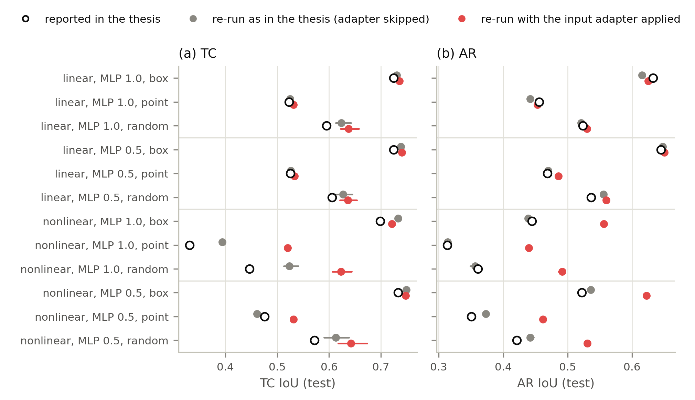
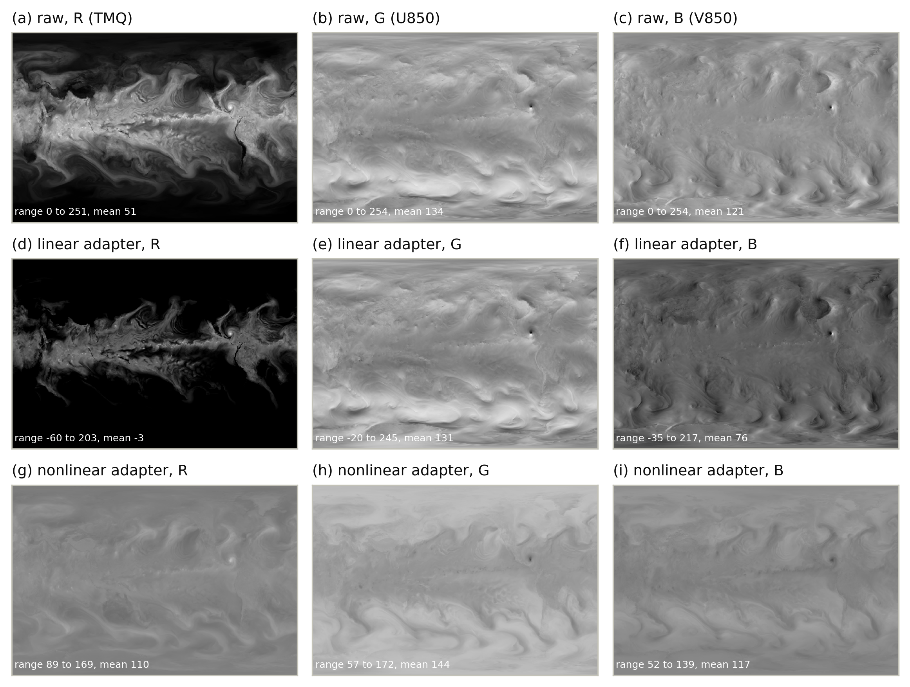
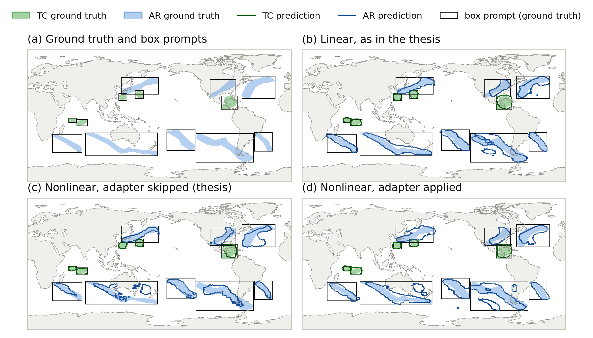
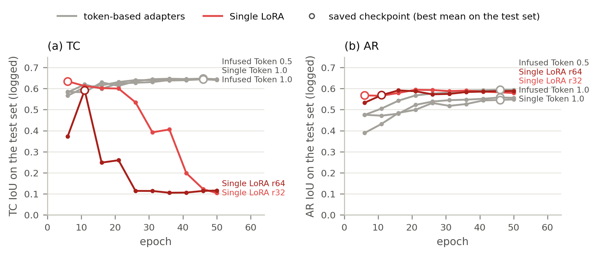
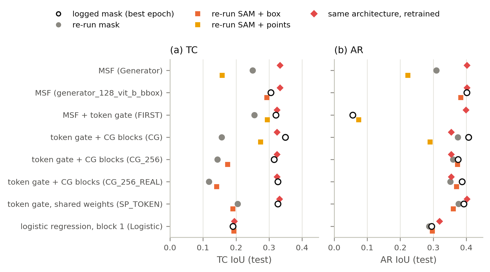
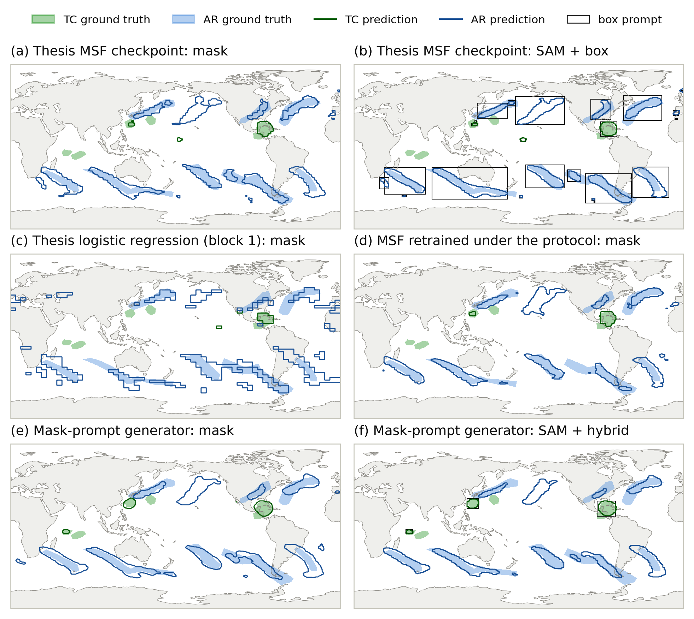

# 08 — Re-evaluation of the thesis' own results

Scripts: `prompter_bench/phase1_recheck.py`, `phase1_examples.py`, `phase2_recheck.py`, `recheck_report.py` (tables +
figures) · data: this folder (`phase1_*.csv` + per-image counts, `phase2_all.csv`, `wandb_histories.json` = the
per-epoch test IoU of the author's wandb runs, `input_adapter_weights.json`, `param_counts.json`,
`adapter_bootstrap.csv`) · tables: `../tables/thesis_recheck_*` · figures: `../figures/thesis_recheck_*`.

**Question.** Do the numbers in Chapter 4 of the thesis (Tables 4.1–4.13 and appendix Table 1) hold when the saved
checkpoints are evaluated again, and are the conclusions drawn from them supported?

**What could be re-checked.** Checkpoints on this machine: the four Infused Token Phase-1 models of the appendix table
(linear and nonlinear input adapter, MLP ratio 1.0 and 0.5), several extra Infused Token variants, and all Phase-2
prompter checkpoints of Section 4.3.3. The Concat Token, Single Token, Single and Dual LoRA checkpoints are not on this
machine; for Single Token and Single LoRA the author's training logs (local wandb runs) could be read instead. Tables
4.1–4.5 are hyperparameter sweeps (training runs) and were checked only for internal consistency.

## 1. Phase-1 models (Tables 4.6, 4.8, 4.10, 4.12, appendix Table 1)

Re-evaluated with the thesis pipeline itself: `ClimateDataset(train_flag=False, generate_prompt=True, prompt_type=…)`
(the 61 test images, prompts from the ground truth), `ClimateSAM.infer` / `forward`, and TC and AR scored as two
independent binary problems (as `StreamSegMetrics` in `train_adaptation.validate_one_epoch`). Two image paths:

- **as in the thesis:** `ClimateSAM.set_infer_img()` — what the validation of `train_adaptation.py` (and
  `test_prompt_effect.py`) calls. It feeds the **first three raw channels** (TMQ, U850, V850) to the encoder and **never
  applies the learned input adapter**.
- **adapter applied:** `ClimateSAM.encode_images()` — the 16 channels through the input adapter, exactly as in training.

`random` prompts are drawn per image (point or box) and change with every evaluation, so they were drawn three times.

{{table:thesis_recheck_phase1}}

### Finding 1 — the linear models reproduce

For the linear adapter, box and point prompts reproduce the appendix table within about ±0.015 IoU (e.g. MLP 0.5, box:
TC 0.738 / AR 0.648 vs. 0.724 / 0.645). Skipping the adapter changes the linear models by only 0.00–0.02: the adapter
keeps its identity weights for TMQ / U850 / V850 (≈ 1, Table 4.7), so the raw channels have the same spatial structure
as the adapter output, although with different offsets (adapter-input figure below, rows a–c vs. d–f).

The **random** prompt rows do not reproduce exactly: the thesis values (e.g. TC 0.595 for linear 1.0) lie below all three
re-draws (0.613–0.642). "Random" is a different random mixture of point and box images at every evaluation (TC spread of
0.03 across three draws), so a single evaluation cannot be reproduced; it should either be dropped or reported as
mean ± spread over fixed seeds.

### Finding 2 — the nonlinear results are an evaluation artefact

The nonlinear adapter (3×3 conv, BatchNorm, 1×1 convs, sigmoid) produces low-contrast images (values 50–170,
rows g–i of the figure below). The nonlinear models' encoders were trained on those images but evaluated on the raw
channels (values 0–255, rows a–c), i.e. on inputs they never saw. With the adapter applied, the nonlinear models gain **+0.04 to +0.13 mean FG
IoU** (paired bootstrap, all mean-FG intervals above zero; AR +0.09 to +0.14):

{{table:thesis_recheck_adapter_bootstrap}}

Consequences for Section 4.2.1 / Table 4.6:
- The linear adapter is still slightly better, but by **+0.005 to +0.042 mean FG IoU** (mostly AR, TC mixed; not
  significant for MLP 0.5 with random prompts), not by +0.06 to +0.17 as reported (appendix Table 1). The thesis' "as in the thesis"
  comparison reproduces the large gap (+0.05 to +0.14), so the gap is caused by the evaluation, not by the adapter.
- The explanation given in the thesis (the 3×3 convolution blurs the sharp TC / AR structures) is therefore not
  supported by the data; at most a small AR advantage of the linear adapter remains.
- All nonlinear rows of the appendix table (Concat, Single Token, Single / Dual LoRA) were produced with the same
  validation code and are very likely affected in the same way; their checkpoints are not available to re-check.

*Test image 17, ground-truth box prompts. (c) The nonlinear model evaluated as in the thesis cuts the long southern
rivers into fragments and misses parts inside the boxes; (d) the same checkpoint with its adapter applied follows the
rivers like the linear model (b). Second example: `../figures/thesis_recheck_maps_nonlinear_45.png`.*

### Finding 3 — every Phase-1 number is selected on the test set, and LoRA's TC performance collapses

`train_adaptation.py` validates on `ClimateDataset(train_flag=False)` — the 61 **test** images — every five epochs and
saves the epoch with the best mean of TC and AR IoU. The author's wandb logs show what this selection does:

{{table:thesis_recheck_training_logs}}

- For the token-based adapters the curves plateau and the selected epoch is close to the last (difference ≤ 0.01), so
  the selection bias is small.
- For **Single LoRA** the TC IoU on the test set **collapses during training**: rank 32 from 0.63 (epoch 6) to 0.10
  (epoch 50), rank 64 from 0.59 (epoch 11) to 0.12. The LoRA rows of Tables 4.6 / 4.8 come from the early epoch picked
  on the test set. A held-out selection would pick a similar epoch only if the collapse is visible on held-out data too;
  either way, the claims of Section 4.2.2 (rank 32 more stable than rank 64, rank as a regulariser) should be qualified:
  **both ranks collapse on TC**, and the reported values describe the best test epoch, not a converged model.
- The training loop also tracks the best TC and the best AR IoU separately (they can come from different epochs); the
  saved checkpoint uses the mean, and the appendix numbers match the saved checkpoints, so the tables are not mixtures of
  epochs.

### Finding 4 — smaller consistency checks

| Thesis object | Check | Result |
|---|---|---|
| Table 4.7 (adapter weights) | final weights read from the checkpoints | identical (to 4 decimals) to the **NOSMOOTH** checkpoint, not to the label-smoothed checkpoint whose IoUs are quoted in Figure 4.2 / Table 4.6 (max. difference 0.036). Say which run the table shows. |
| Tables 4.9 / 4.11 (parameter counts) | recount with `ClimateSAM.train(phase=2)` | Infused Token rows exact (e.g. linear 0.5: 4.38 M trainable, 98.11 M total, 4.46 %) |
| Table 4.3 vs. text vs. Table 4.4 | focal weight | the text calls a focal weight of 10 "the best balance", Table 4.4 lists 1; by Table 4.3, weight 1 has the higher mean (TC 0.555 / AR 0.330 vs. 0.558 / 0.300), so Table 4.4 is consistent and the sentence is wrong |
| Table 4.2 vs. text vs. Table 4.4 | AR focal parameters | text: best AR with γ = 2.0, α = 0.90; Table 4.2: best AR IoU with α = 0.85, γ = 5.0 (0.3365 vs. 0.3296); Table 4.4 uses 0.85 / 5.0 — the sentence is inconsistent. The row α = 0.995, γ = 4.0 has mean = best = 0.5203 (a single run?), which is higher than the "optimal" 0.5076 mean |
| Table 4.8 | ordering | caption "ordered by mean IoU", text "ordered by TC IoU"; the rows follow neither strictly |
| Table 4.13 | re-run | not reproducible (see `02_table_4_13_recheck/`) |

## 2. Phase-2 prompter checkpoints (Section 4.3.3, author's runs)

The subsections of Section 4.3.3 are empty in the thesis; the only record of these prompters are the author's
checkpoints (`exp/best_weights/best_generator*.pth`, `best_logistic_regression*.pth`) and wandb runs. Each checkpoint was
evaluated on the benchmark (`phase2_recheck.py`) with the frozen encoder named in its wandb config, its original class,
and its original decision rule (3-class softmax, argmax = prompter mask), and compared with (a) the best value the run
logged and (b) the same architecture trained under the benchmark protocol (`04_sam_feature_prompters/`).

{{table:thesis_recheck_phase2}}

### Finding 5 — where the encoder still exists, the log reproduces

One checkpoint can be checked cleanly, because its training encoder is unchanged: the MSF run
`generator_128_vit_b_bbox` (MLP-0.5 encoder, 10 April) reproduces its log exactly (mask TC 0.304 / AR 0.401 vs. logged
0.305 / 0.402; SAM + box 0.294 / 0.383 vs. logged 0.308 / 0.389, where the author's SAM pipeline differs slightly in the
prompt construction). The benchmark pipeline is therefore faithful to the author's evaluation.

### Finding 6 — the other checkpoints were trained on an encoder file that was later overwritten

All other prompters were trained on 4–5 April with the encoder `best_weights/infused_token_vitb_mlp1_best.pth`, and that
file was rewritten on **5 April at 15:40**, after these runs (file modification times vs. wandb start times). With the
current file, the deep-feature prompters lose most of their TC IoU (e.g. CG blocks: logged 0.349 → 0.157; shared-weight
token gate: 0.326 → 0.205) while AR changes little (0.407 → 0.374), the pattern expected when the features change and
small objects suffer first. Only the logistic regression, which reads the *first* ViT block, still reproduces
(0.190 / 0.287 vs. logged 0.191 / 0.295), consistent with an encoder change that mostly affects later blocks. The re-run
numbers of the deep-feature checkpoints are therefore lower bounds, and their logged values cannot be verified. Two
further inconsistencies in the files:
- `best_generator_token_cg_vit_b_256_CG_256*.pth` contain a **128-channel** model although the runs were configured with
  `fuse_channels = 256` (the class does use the argument), so these files do not come from the runs they are named after;
- `best_generator_vit_b_128_Generator.pth` was saved at 12:59, before the wandb run "Generator" started (13:08).

### Finding 7 — the conclusions of the benchmark hold for the author's own prompters

- SAM prompted by the author's prompters is not better than their masks either (MSF `generator_128_vit_b_bbox`: SAM +
  box 0.294 / 0.383 vs. mask 0.304 / 0.401; only the very weak logistic regression gains marginally).
- The same architectures trained under the benchmark protocol (two sigmoid channels, held-out selection) are equal or
  better: MSF 0.333 / 0.403 vs. 0.304 / 0.401 (the author's run used the MLP-0.5 encoder), logistic regression on block 1
  0.195 / 0.319 vs. 0.190 / 0.287.
- The first token-gated run ("FIRST") predicts almost no AR (AR IoU 0.056, one AR object per image); it stopped after a
  single validation.
- All author runs also validated on the **test** images and saved the epoch with the best average test IoU.

*Test image 17. (a, b) the author's MSF checkpoint that reproduces its log, and SAM prompted by its boxes;
(c) the author's logistic regression on ViT block 1 — the 16×16-pixel blocks of the first ViT block are visible;
(d) MSF and (e, f) the mask-prompt generator trained under the benchmark protocol. Second example:
`../figures/thesis_recheck_maps_prompters_45.png`.*

## 3. What should change in the thesis

1. **Section 4.2.1 / Table 4.6 / appendix Table 1 (nonlinear rows):** re-evaluate with the input adapter applied (fix
   `validate_one_epoch` to use `encode_images`). The large linear-vs-nonlinear gap and its "spatial blurring"
   explanation do not survive; the linear adapter keeps a small AR advantage (+0.02 to +0.07 AR IoU).
2. **All Phase-1 tables:** state that checkpoints were selected on the test set; for LoRA (Section 4.2.2, Table 4.8)
   add that TC IoU collapses during training for both ranks and that the reported values are from the best test epoch.
3. **"Random" prompt rows:** report mean ± spread over fixed seeds, or drop them.
4. **Table 4.7:** name the run (NOSMOOTH checkpoint). **Tables 4.2–4.4:** align the text with the tables (focal weight,
   AR focal parameters).
5. **Section 4.3.3:** use the benchmark results (`04_sam_feature_prompters/`); the author's own prompter checkpoints
   cannot be reproduced (overwritten encoder), except MSF `generator_128_vit_b_bbox` (and the block-1 logistic
   regression), which confirm the benchmark conclusions.

Checkpoints not on this machine (Concat Token, Single Token, Dual LoRA, all LoRA / Single / Concat nonlinear variants)
could not be re-evaluated; if they are available elsewhere, `phase1_recheck.py` evaluates them after adding one line to
`CHECKPOINTS`.
