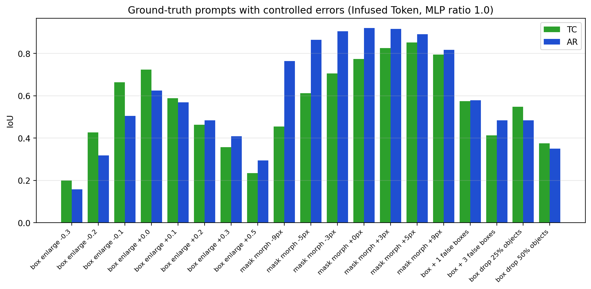
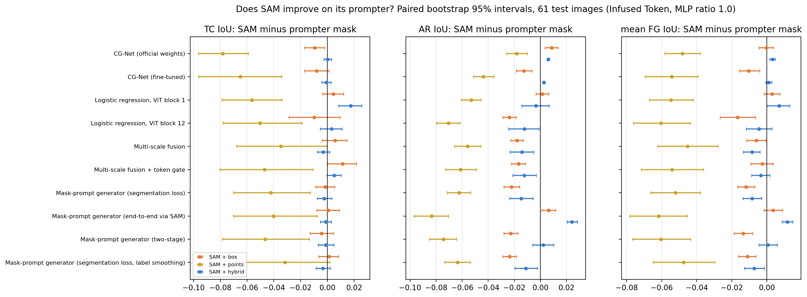
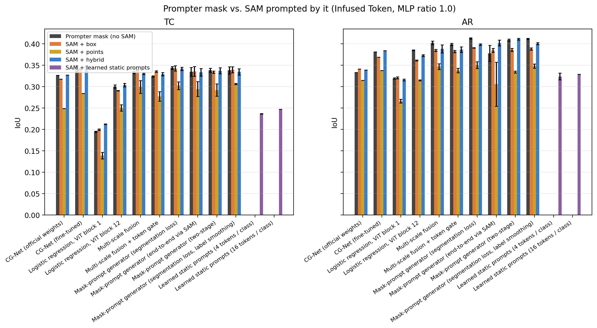
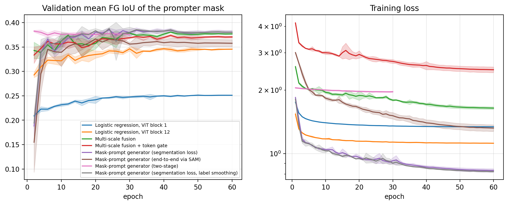
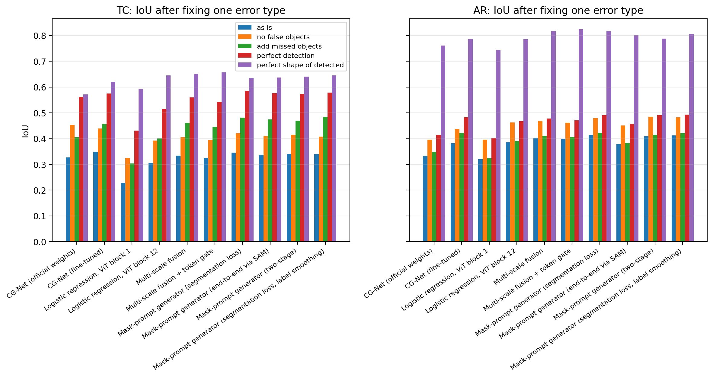
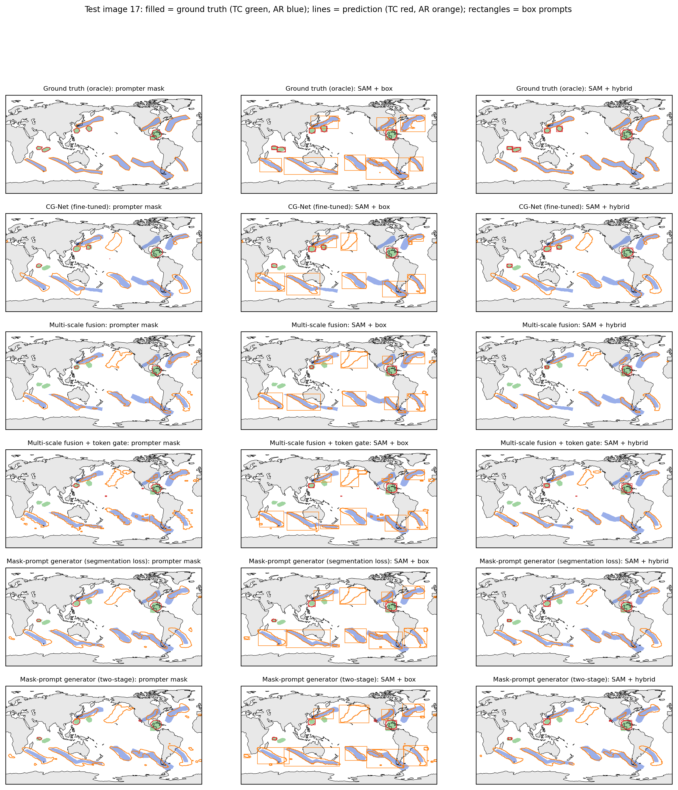
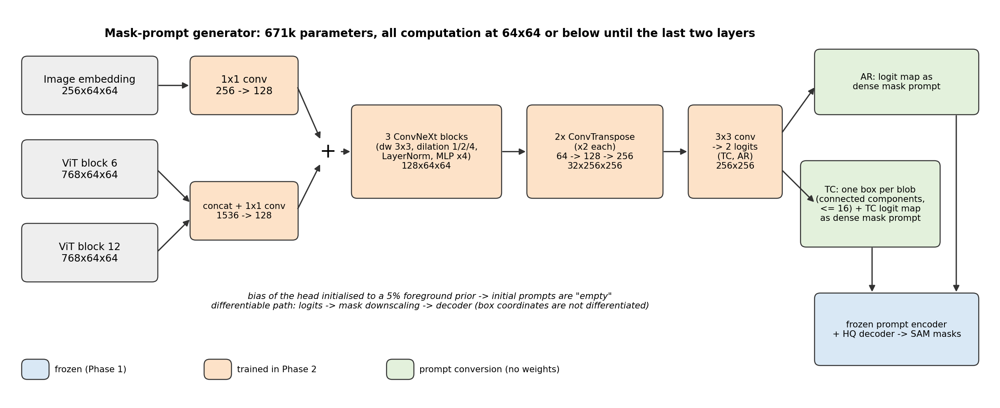
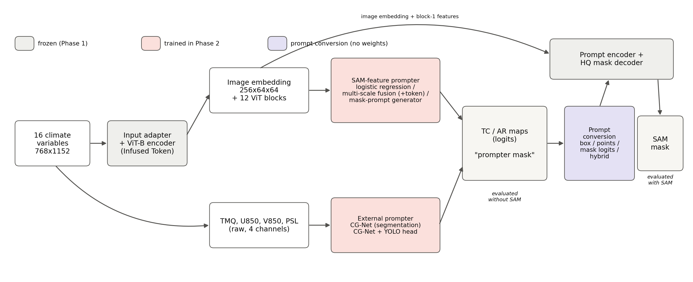

# Section 4.3 — Automatic prompting of ClimateSAM: all experiments, data and conclusions

Everything needed for Section 4.3 (Automatic Prompt Generator for SAM) and the corresponding part of the Discussion:
the corrected Table 4.13, a controlled comparison of all prompters (the thesis prompters + a new mask-prompt
generator), oracle studies, significance tests, decoder adaptation, negative results, figures, LaTeX tables and all raw
data. Tables below are generated from the raw outputs (`prompter_bench/make_report.py`); LaTeX versions are in
`tables/*.tex` (need `\usepackage{booktabs}`), CSV versions in `tables/*.csv`.

## Summary

1. **The SAM rows of the original Table 4.13 do not reproduce.** With the thesis pipeline itself, SAM prompted by
   CG-Net reaches TC 0.341 / AR 0.369 (tight boxes), *below* CG-Net alone (0.349 / 0.382), not 0.430 / 0.482. The
   ranking of prompt types in the table is confirmed. → `02_table_4_13_recheck/`
2. **With automatically generated prompts, SAM does not improve on the prompter that produced them** — for every
   prompter (CG-Net, logistic regression, multi-scale fusion, token-gated fusion, mask-prompt generator), every prompt
   type (boxes, points, boxes + points, dense masks, hybrid) and both frozen checkpoints. SAM's output stays within
   about ±0.02 mean FG IoU of its prompter's own mask (gains up to +0.012 / +0.019 only for the prompter with the
   weakest mask, the end-to-end generator; points always lose 0.03–0.08), and the best SAM output overall equals the
   best prompter mask (primary checkpoint 0.376 vs. 0.379; second checkpoint 0.373 vs. 0.371, within noise). Paired
   bootstrap intervals: `tables/bootstrap_*`, `figures/sam_minus_prompter_*`. → `04_sam_feature_prompters/`
3. **Why:** the Phase-1 decoder was trained with perfect prompts and *reproduces* its prompts. Oracle experiments
   show every false box becomes a false object, every missed object stays missed and ±10–20 % box errors cost
   0.1–0.3 IoU (`01_oracle_prompts/`). The prompters' remaining errors are exactly those: for ARs almost all lost IoU
   is the extent/shape of rivers that were found; for TCs a third of the cyclones is missed and half the predicted
   blobs are false (`tables/error_decomposition_*`).
4. **Fine-tuning the decoder on generated prompts** (incl. out-of-fold prompts, so the decoder sees realistic prompt
   errors) teaches it to drop some false prompts (AR object precision 0.50 → 0.62) and closes most of the gap to the
   prompter, but still does not exceed it. → `05_decoder_adaptation/`
5. **The best automatic system is a small prompter on the frozen ClimateSAM features.** The new 0.67 M-parameter
   mask-prompt generator reaches TC 0.344 / AR 0.413 on its own (3 seeds): AR +0.031 over the fine-tuned CG-Net
   (95 % CI [+0.020, +0.043]) at statistically equal TC, and +0.011 mean FG IoU over the thesis' 1.41 M-parameter
   multi-scale fusion generator (CI [+0.003, +0.019]) with ~120× fewer FLOPs (5.7 vs. 702 GFLOPs per image,
   0.9 vs. 36 ms). SAM prompted by it reaches
   TC 0.342 / AR 0.398 (hybrid prompts). A 1.5 k-parameter linear probe on the last ViT block already reaches
   TC 0.301 / AR 0.385 — the adapted encoder's features carry most of the signal. The same ranking holds on the
   second frozen checkpoint.
6. **Prompt format matters, and in a checkpoint-dependent way.** Dense mask prompts must be logits for some
   checkpoints, and TCs vanish from mask-only prompts on others; a box plus a dense mask for TC and a dense mask for
   AR ("hybrid") is the robust choice (oracle: TC 0.872 / AR 0.920 vs. boxes 0.723 / 0.625).
7. **Also negative:** a YOLO box head on CG-Net (TC ≈ 0.21 / AR ≈ 0.28 via SAM); learned static prompts without any
   prompter (TC 0.24 / AR 0.33, thousands of fragments); the token gate on multi-scale fusion (−0.006 mean FG IoU);
   training the generator end-to-end through SAM (−0.011) or two-stage (−0.004); label smoothing for the prompter
   (−0.004); more ViT blocks as input (exploratory).

## Folder guide

| Folder | Content |
|---|---|
| `00_setup/` | protocol shared by every experiment (checkpoint choice, split, loss, metrics), `split.json` |
| `01_oracle_prompts/` | ground-truth prompts: prompt types, mask-prompt format, controlled prompt errors |
| `02_table_4_13_recheck/` | corrected Table 4.13 (CG-Net as prompter), incl. the original-script path |
| `03_cgnet_yolo_boxes/` | CG-Net with a YOLO box head as prompter |
| `04_sam_feature_prompters/` | main comparison of all prompters (designs, bugs found, results) |
| `05_decoder_adaptation/` | fine-tuning the decoder on generated prompts (in-sample vs. out-of-fold) |
| `07_exploratory_runs/` | first mask-prompt-generator runs incl. failed designs, analysis of the old generator |
| `tables/` | every table as LaTeX (`.tex`), CSV and Markdown |
| `figures/` | every figure as PNG and PDF (diagrams, bar charts, curves, map examples) |
| `runs/<encoder>/<run>/` | per run: `log.csv` (every epoch), `summary.json`, `best.pth` |
| `eval/<encoder>/` | test results per run (`*.json`, incl. per-image counts), example masks (`*_examples.npz`), `all_results.csv` |
| `logs/` | stdout of every job |

Encoders: `infused_mlp1` = primary (Infused Token, MLP 1.0, the model of Table 4.12 / Section 4.3),
`infused_mlp05` = robustness check (Infused Token, MLP 0.5).

## 1. Oracle prompts (upper bounds, `01_oracle_prompts/`)

| Prompt from the ground truth | TC | AR |
|---|---|---|
| tight box | 0.723 | 0.625 |
| points (5 pos. + centroid + 5 neg.) | 0.527 | 0.577 |
| dense mask (±10 logits) | 0.774 | 0.920 |
| hybrid (TC: box + mask, AR: mask) | 0.872 | 0.920 |
| box enlarged 20 % | 0.463 | 0.484 |
| 25 % of the objects not prompted | 0.548 | 0.483 |
| + 1 random false box per class | 0.574 | 0.578 |



## 2. Corrected Table 4.13 (`02_table_4_13_recheck/`)

{{table:table_4_13_corrected}}

## 3. All prompters under one protocol (`04_sam_feature_prompters/`)

Frozen primary checkpoint, 358 train / 40 validation / 61 test images, loss of Table 4.4, 60 epochs, checkpoint
selected on validation, mean ± std over 3 seeds (CG-Net: fixed checkpoints).

{{table:main_infused_mlp1}}

TC / AR IoU for every way of turning the prompter output into SAM prompts:

{{table:prompt_conversion_infused_mlp1}}

Paired bootstrap over the test images (seeds pooled):

{{table:bootstrap_infused_mlp1}}

Object-level detection of the prompter masks:

{{table:object_level_infused_mlp1}}

Where the IoU is lost (IoU of the prompter mask after fixing one error type):

{{table:error_decomposition_infused_mlp1}}

Size and training cost:

{{table:cost_infused_mlp1}}

Inference cost (`04_sam_feature_prompters/speed.csv`):

{{table:speed}}






Examples (map projection; filled = ground truth, lines = prediction, rectangles = box prompts):



Architecture of the mask-prompt generator and of the benchmark:




## 4. Decoder adaptation (`05_decoder_adaptation/`)

{{table:decoder_adaptation_infused_mlp1}}

Second checkpoint:

{{table:decoder_adaptation_infused_mlp05}}

## 5. Robustness: second frozen checkpoint (Infused Token, MLP 0.5)

Same protocol; multi-scale models 1 seed.

{{table:main_infused_mlp05}}

## 6. Exploratory runs (`07_exploratory_runs/`)

{{table:exploratory_runs}}

## Key findings, phrased for the thesis

- *Automatic prompting* (Section 4.3): a prompter only helps SAM as much as its prompts are correct, and SAM with
  generated prompts is bounded by the prompter. The upper bound with perfect prompts is high (hybrid prompts:
  TC 0.87 / AR 0.92), so the thesis' encoder adaptation works; the limit is prompt quality, i.e. *detection*.
- *Prompt type*: tight boxes are the best sparse prompt (confirming Table 4.12); points are worst; enlarging boxes
  hurts monotonically; dense mask prompts carry the AR shape and are more forgiving to prompt errors than boxes.
- *Where prompters fail*: AR — extent of rivers already detected (perfect shapes of detected ARs would give ~0.8 IoU);
  TC — missed cyclones and false blobs (perfect detection would give ~0.55–0.6 TC IoU).
- *Efficiency*: a 0.67 M-parameter head at 64×64 on the frozen features beats the 1.41 M-parameter multi-scale
  fusion model that runs at 1024×1024 (5.7 vs. 702 GFLOPs, 0.9 vs. 36 ms per image), and beats
  CG-Net on AR; even a linear probe on the last ViT block is close to CG-Net. The token gate adds nothing: the gate
  inputs are fixed decoder tokens, i.e. a learned per-class channel weighting. The adapted encoder is a strong representation for detection; SAM's decoder adds shape refinement only when
  the prompt is already right.
- *Recommendation for the pipeline*: use the prompter's own mask as the prompt-free output, or SAM with hybrid prompts
  when SAM-quality boundaries are wanted — the two are within ~0.01 IoU. To make SAM *improve* on the prompter, the
  decoder must be trained with realistic (erroneous) prompts from the start of Phase 1, or the detection step must
  improve; decoder fine-tuning afterwards is not enough.

## Bugs found in the original code (details in `04_sam_feature_prompters/README.md`)

1. `test_prompt_effect.py` → `ClimateSAM.set_infer_img()` skips the learned input adapter.
2. Multi-scale generators: the background channel is never supervised but takes part in the final argmax.
3. `LogisticRegressionPrompter` classifies the first ViT block (`feat_list[0]`).
4. `StreamSegMetrics.update(pred, gt)` called with swapped arguments (IoU unaffected, accuracies affected).
5. Best epochs selected on the test set in all original scripts.
6. The official CG-Net checkpoint has BatchNorm running statistics that do not match its weights.
7. The fine-tuned CG-Net saw all training images, so its outputs on training images are optimistic.

## Reproduce

```bash
cd ClimateSAM
.venv/bin/python prompter_bench/encoder_check.py                 # 00: checkpoint choice
.venv/bin/python prompter_bench/build_cache.py infused_mlp1 infused_mlp05   # encoder features (≈35 GB each, exp/feature_cache)
.venv/bin/python prompter_bench/oracle_sweep.py --encoder infused_mlp1      # 01
.venv/bin/python prompter_bench/table413_recheck.py                          # 02
.venv/bin/python prompter_bench/yolo_eval.py                                 # 03
bash prompter_bench/run_queue.sh infused_mlp1 light; bash prompter_bench/run_queue.sh infused_mlp1 heavy   # 04 training
bash prompter_bench/run_extra.sh infused_mlp1                                # 05 + label smoothing
bash prompter_bench/run_learned_prompt.sh infused_mlp1                       # learned static prompts
.venv/bin/python prompter_bench/evaluate.py --encoder infused_mlp1           # test evaluation of everything
.venv/bin/python prompter_bench/speed.py                                     # parameters / FLOPs / latency
.venv/bin/python prompter_bench/make_report.py                               # tables, figures, this README
.venv/bin/python prompter_bench/diagrams.py                                  # architecture diagrams
```
