# Automatic prompting of ClimateSAM for prompt-free TC and AR segmentation

*Experiments, results and analysis for Section 4.3 (“Automatic Prompt Generator for SAM”) and the Discussion.*

All numbers in this report are produced by the code in `prompter_bench/` and can be regenerated from the raw outputs
in `results/` (see Appendix C). Figures are in `results/figures/`; every multi-panel figure also exists as separate
single-panel files in `results/figures/panels/` (Appendix B lists them). LaTeX versions of all tables are in
`results/tables/*.tex`.

**Abbreviations.** TC tropical cyclone, AR atmospheric river, FG foreground, IoU intersection over union,
MSF multi-scale fusion generator (thesis Figure 3.9), MPG mask-prompt generator (proposed here), LogReg logistic
regression prompter, CI confidence interval, OOF out-of-fold.

---

## Abstract

Phase 1 of the thesis adapted SAM to the 16-channel ClimateNet data with a learnable input adapter and infused-token
encoder adapters; with ground-truth box prompts the adapted model reaches TC IoU 0.72 and AR IoU 0.63. Phase 2 must
replace the ground-truth prompts by prompts produced automatically. We compare every prompter developed in the thesis
(CG-Net, re-trained under the same protocol, CG-Net with a YOLO box head, logistic regression, multi-scale fusion with
and without the token gate and its CG-block and shared-weight variants, a box head on the SAM features) and a new,
lightweight mask-prompt generator under one controlled protocol: one frozen Phase-1 model, a held-out validation split,
the loss selected in Section 4.1, three seeds, seven ways of converting a prompter output into SAM prompts, paired
bootstrap confidence intervals, object-level metrics and an error decomposition. We further test training the prompter
through SAM, fine-tuning SAM's decoder on generated prompts, a decoder trained to be robust to corrupted prompts,
learned static prompts, and evaluation-time ensembling, calibration, post-processing and iterative refinement.

Three results stand out. (i) The SAM rows of the original Table 4.13 do not reproduce; SAM prompted by CG-Net is not
better than CG-Net alone (TC 0.341 / AR 0.369 vs. 0.349 / 0.382). (ii) Across all prompters, prompt types and both
frozen checkpoints tested, SAM's output stays within about ±0.02 mean FG IoU of the prompter's own mask and never
exceeds the best prompter mask; the decoder reproduces its prompts, including their errors. (iii) A 0.67 M-parameter
mask-prompt generator operating on the frozen encoder features at 64×64 is the best single prompter
(TC 0.344 / AR 0.413) at 122× fewer FLOPs than the multi-scale fusion generator. Against a CG-Net re-trained under the
same protocol (0.375 mean FG IoU instead of 0.366 for the stored checkpoint) its advantage is limited to the ARs
(+0.013 to +0.018, significant); the overall difference is not significant. An ensemble of both families gives the best
mask of the study (0.389). A decoder trained on corrupted prompts becomes robust to synthetic box errors but gains only
+0.005 with real prompts and stays below the prompter. The error analysis shows that the remaining errors are the extent
of ARs that were detected and the detection of TCs — precisely the information a prompt would have to contain.

---

## 1. Motivation and research questions

SAM is a *promptable* segmenter: given an image embedding and a prompt (points, boxes or a dense mask) it predicts the
mask the prompt refers to. Phase 1 trained ClimateSAM's decoder with prompts derived from the ground truth
("perfect prompts", Section 3.1). An operational, prompt-free system needs a *prompter* that proposes the prompts. The
question behind Section 4.3 is whether such a pipeline — prompter → prompts → SAM — outperforms the prompter itself, and
which prompter and prompt format work best. We make this concrete as five research questions:

- **RQ1 — Upper bound.** How well can the frozen Phase-1 SAM segment TCs and ARs if the prompts are perfect, and how
  sensitive is it to realistic prompt errors?
- **RQ2 — Reproducibility.** Does the original Table 4.13 (SAM with CG-Net as prompter) hold?
- **RQ3 — Prompters.** Which prompter produces the best masks and prompts, under identical training and evaluation
  conditions, and at what cost?
- **RQ4 — Added value of SAM.** Does SAM prompted by a prompter segment better than the prompter alone, for any prompt
  type? If not, can this be changed by training the prompter through SAM or by adapting SAM's decoder?
- **RQ5 — Failure modes.** Where exactly do the automatic systems lose IoU?

---

## 2. Experimental setup

### 2.1 Frozen model, data and features

Every experiment uses one frozen Phase-1 model. We selected it by prompting every Infused-Token checkpoint with
ground-truth prompts (`00_setup/encoder_candidates_gt_prompts.csv`):

| Tag | Checkpoint | Role | GT box TC / AR | Thesis Table 4.12 |
|---|---|---|---|---|
| MLP 1.0 | `infused_token_vit_b_1.0_infused_token_vit_b_mlp1_CORRECTED` | primary (the model named in Section 4.3) | 0.723 / 0.625 | 0.724 / 0.632 |
| MLP 0.5 | `infused_token_vit_b_0.5_infused_token_vit_b_mlp05_CORRECTED` | robustness check | 0.728 / 0.650 | 0.724 / 0.645 |

The small differences to Table 4.12 come from the connected-component threshold (20 px, as in `PromptMaker`, vs. 50 px).

**Split.** The 398 ClimateNet training images are split once into 358 training and 40 validation images (fixed seed);
the 61 test images are used only for the final evaluation of each model. The original scripts selected the best epoch
on the test set, which biases their numbers upwards; here every learned prompter is selected on the validation images.

**Feature cache.** In Phase 2 the input adapter and encoder are frozen, and no augmentation is used (geometric
augmentation would break the latitude priors, Section 2.2.2). We therefore run the encoder once per image and cache
its outputs (neck embedding $E\in\mathbb{R}^{256\times64\times64}$, all twelve ViT block outputs
$F_\ell\in\mathbb{R}^{768\times64\times64}$) and the four CG-Net input fields. This is mathematically identical to
running the encoder in every step and reduces a 60-epoch training of a small prompter from hours to minutes.


*Figure 1 — Benchmark pipeline. All prompters produce TC / AR logit maps (“prompter mask”), which are evaluated
directly and after conversion into prompts for the frozen prompt encoder and HQ decoder. Grey: frozen Phase-1
components; light red: trained in Phase 2; violet: prompt conversion (no weights).*

### 2.2 Prompters

All learned prompters are re-implemented behind one interface (`prompter_bench/prompters.py`) and output two sigmoid
channels, TC and AR. The network code is the thesis code in `model/`.

| Prompter | Input | Architecture | Parameters | GFLOPs / image | Latency |
|---|---|---|---|---|---|
| CG-Net (official / fine-tuned / re-trained) | TMQ, U850, V850, PSL | ClimateNet CG-Net, 3-class softmax; re-trained on the 358 training images with its Jaccard loss (official init. or scratch) | 494 k | 22.9 | 8.9 ms |
| LogReg, block 1 | $F_1$ | 1×1 convolution 768 → 2 (thesis `LogisticRegressionPrompter`) | 1.5 k | 0.01 | 0.05 ms |
| LogReg, block 12 | $F_{12}$ | same, last block | 1.5 k | 0.01 | 0.05 ms |
| MSF | $F_1\ldots F_{12}$ | Figure 3.9: four groups of three blocks, nearest upsampling up to 1024², deep supervision | 1.41 M | 702 | 36 ms |
| MSF + token gate | $F_1\ldots F_{12}$ | MSF whose fused features are gated per channel by the decoder's refined TC / AR HQ tokens, two binary heads | 1.42 M | 703 | 38 ms |
| MSF + token gate, CG blocks | $F_1\ldots F_{12}$ | token-gated MSF with context-guided blocks (`prompt_generator_token_cgblock.py`) | 1.31 M | 452 | 63 ms |
| MSF + token gate, shared weights | $F_1\ldots F_{12}$ | token-gated MSF with one reduction / fusion shared by the four block groups (`prompt_generator_sp_token.py`) | 0.39 M | 612 | 35 ms |
| Box head on SAM features | $E$ + HQ tokens | YOLO-style grid detector gated by the HQ tokens (`TokenGatedDetectionHead`), boxes prompt SAM | 0.61 M | — | — |
| **MPG (new)** | $E$, $F_6$, $F_{12}$ | Figure 2 | **0.67 M** | **5.7** | **0.9 ms** |
| MPG + raw fields | $E$, $F_6$, $F_{12}$, CG-Net fields | MPG + the four fields added at 64² and 256² (zero-initialised branches) | 0.69 M | 7.1 | 1.1 ms |
| Learned static prompts | — | 4 (or 16) learnable sparse prompt tokens per class, no image-dependent prompter | 2 k (8 k) | — | — |

*(FLOPs counted with `torch.utils.flop_counter`, latency = median of 20 forward passes, batch 1, A100; the frozen
encoder costs 973 GFLOPs / 122 ms and one decoder call 16.8 GFLOPs / 3.4 ms — `04_sam_feature_prompters/speed.csv`.)*

Two design details of the thesis prompters matter for the comparison. The original multi-scale generators predicted
three channels, but `compute_generator_loss` supervises only channels 1 and 2 as independent sigmoids while the
prediction is the 3-channel argmax; the background channel is an untrained projection that competes with TC and AR
(Appendix A). Here all prompters use two sigmoid channels thresholded at 0. The logistic-regression prompter of the
thesis reads `feat_list[0]`, the *first* ViT block; we evaluate it as is and on the last block.

**Mask-prompt generator (MPG).** The design follows from three observations: (1) the encoder features live on a 64×64
grid, so upsampling them to 1024² before the prediction (as MSF does, with nearest-neighbour upsampling) adds
computation but no information; (2) the only output resolution SAM needs is its dense-prompt resolution, 256×256;
(3) ARs are long, so the prediction needs a large receptive field. MPG therefore projects $E$ and the concatenation of
$[F_6;F_{12}]$ to 128 channels each, sums them, applies three ConvNeXt blocks at 64×64 with dilations 1, 2, 4
(depth-wise 3×3 convolution, LayerNorm, 1×1 expansion ×4, GELU, 1×1 projection, residual), and upsamples with two
transposed convolutions to 256×256 before a 3×3 convolution predicts the two logit maps. The bias of the last layer is
initialised to the logit of a 5 % foreground prior, $b=-\log\frac{1-\pi}{\pi}$ with $\pi=0.05$, so that the initial
prompts are nearly empty instead of random.


*Figure 2 — Mask-prompt generator and how its two logit maps become SAM prompts (the "hybrid" conversion of Section 2.3).*

### 2.3 From prompter output to SAM prompts

A prompter produces a logit map $\ell_c$ per class $c\in\{\text{TC},\text{AR}\}$ and a binary mask
$m_c=\mathbb{1}[\ell_c>0]$. The mask is split into 8-connected components with at least 20 pixels (as in
`PromptMaker`); for each component we build:

| Conversion | Prompt per component |
|---|---|
| box | tight bounding box |
| box (+10 %) | box enlarged by 10 % of its width / height on each side |
| points | 5 positive points sampled from the eroded component + its centroid, 5 negative points from a ring around it (TC: min(3, n/3) points) |
| box + points | both |
| mask logits | one dense prompt per class: $\ell_c$ resized bilinearly to 256×256 and clamped to $[-20,20]$ (hard masks: $\pm10$) |
| box + mask | every box together with the class's dense prompt |
| **hybrid** | TC: box + mask; AR: mask only |

Boxes and points are mapped from the 1152×768 grid to SAM's 1024×1024 frame (the image is stretched, not padded).
The masks of all prompts of a class are merged by a pixel-wise union (maximum of the logits), as in
`ClimateSAM.assemble_raw_masks`. The hybrid conversion is motivated by the oracle study (Section 3.1): dense prompts
carry the AR shape, but a TC covers only a few cells of the prompt encoder's 64×64 grid, so the TC needs a box.

### 2.4 Training protocol

Every learned prompter is trained with the loss selected in Section 4.1 (Table 4.4), summed over the two classes:

$$
\mathcal{L}_{\text{seg}}=\sum_{c\in\{\text{TC},\text{AR}\}}\Big[\underbrace{1-\frac{TP_c+1}{TP_c+\alpha_c FP_c+\beta_c FN_c+1}}_{\text{Tversky}}\;
\underbrace{-\;\overline{\alpha_{t,c}(1-p_t)^{\gamma_c}\log p_t}}_{\text{Focal}}\Big]
$$

with soft counts $TP_c=\sum_i p_i y_i$, $FP_c=\sum_i p_i(1-y_i)$, $FN_c=\sum_i(1-p_i)y_i$ computed per image,
TC: $\alpha=0.3,\beta=0.7$, focal $\alpha=0.95,\gamma=5$; AR: $\alpha=\beta=0.5$, focal $\alpha=0.85,\gamma=5$.
Logits are upsampled bilinearly to 768×1152 before the loss. MSF adds its deep-supervision terms (thesis Eq. 3.4,
weights $0.4/(i+1)$ against nearest-downsampled labels); the token-gated variant additionally supervises its
multiclass head. Optimiser: AdamW, learning rate $10^{-3}$, weight decay $10^{-4}$, cosine decay to $10^{-5}$,
60 epochs, effective batch 8 (gradient accumulation for the MSF models), bf16 autocast. The checkpoint with the best
validation mean FG IoU (evaluated every second epoch) is kept. Three seeds (0, 1, 2) per configuration.

**Training through SAM.** The MPG output can be turned into SAM prompts differentiably: the AR logit map enters the
prompt encoder's mask-downscaling convolutions directly, and the TC logit map does so together with (non-differentiable)
boxes around its connected components. We therefore also train MPG with an additional loss on SAM's output,

$$
\mathcal{L}=\lambda\,\mathcal{L}_{\text{seg}}(\ell,y)+\mathcal{L}_{\text{seg}}\big(\text{SAM}(\text{hybrid}(\ell)),y\big),
$$

either from scratch ("end-to-end", $\lambda=0.5$) or starting from the segmentation-loss model for 30 epochs at
learning rate $10^{-4}$ ("two-stage", $\lambda=1$). The frozen decoder is a fixed differentiable function, so the
gradient reaches the prompter (Figure 3).

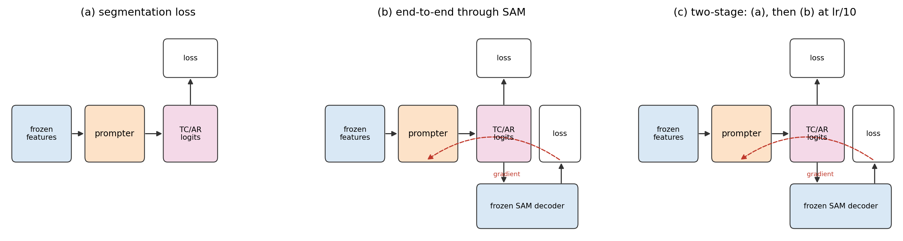
*Figure 3 — The three training modes of the mask-prompt generator.*

### 2.5 Evaluation

**Pixel IoU.** As in the thesis tables, per class $c$ the counts are summed over all $N=61$ test images:
$$\text{IoU}_c=\frac{\sum_n TP_{c,n}}{\sum_n (TP_{c,n}+FP_{c,n}+FN_{c,n})},\qquad
\text{Mean FG IoU}=\tfrac12(\text{IoU}_{\text{TC}}+\text{IoU}_{\text{AR}}).$$
Where both classes are predicted on a pixel, AR wins (as in `test_prompt_effect.py`). Mean IoU additionally averages
the background IoU.

**Object level.** A ground-truth object (8-connected, ≥ 20 px) counts as *found* if any predicted pixel overlaps it;
a predicted object is *correct* if it overlaps any ground-truth object. Recall = found / ground-truth objects,
precision = correct / predicted objects. (With this counting the test set has 2.9 TC and 6.8 AR objects per image.)

**Error decomposition.** For a predicted mask $P$ and ground truth $G$ we compute the IoU after removing one error type
at a time: deleting predicted objects that touch no ground truth ("no false objects"), adding the missed ground-truth
objects ("add missed objects"), both ("perfect detection"), or replacing every *detected* ground-truth object by its
exact shape while keeping false objects ("perfect shape of detected objects"). The gain of each variant over the
prediction measures how much IoU is lost to that error type.

**Significance.** Differences between two outputs A and B are tested with a paired bootstrap over test images:
image indices are resampled with replacement $B=2000$ times, the dataset-level IoU of both outputs is recomputed on
each resample, and the 2.5 / 97.5 % percentiles of $\text{IoU}_B-\text{IoU}_A$ give a 95 % confidence interval.
For learned prompters the per-image counts of the three seeds are pooled, so the interval reflects image sampling
(the dominant source of variance: seed standard deviations are 0.001–0.01).

---

## 3. Results

### 3.1 What SAM can do with perfect prompts (RQ1)

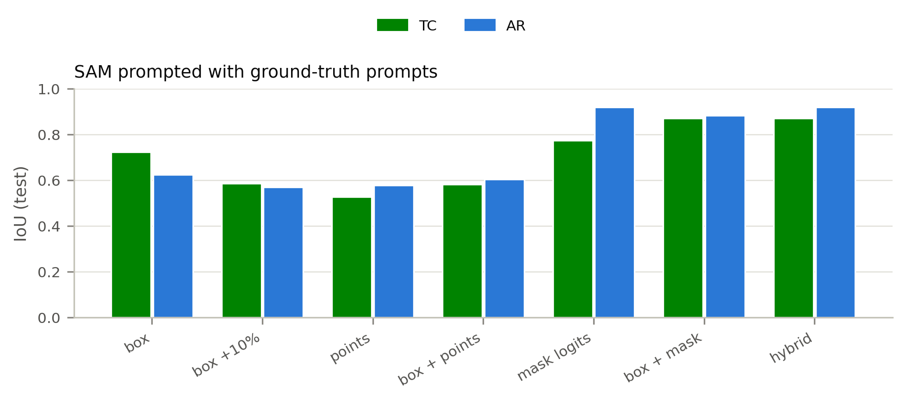
*Figure 4 — SAM (primary checkpoint) prompted with prompts built from the ground truth.*

With perfect prompts, the tight box is the best sparse prompt (TC 0.723 / AR 0.625), points are the worst
(0.527 / 0.577), and adding points to boxes *hurts* (0.583 / 0.604) — the same ranking as thesis Table 4.12.
Dense prompts are better still, because they carry the object's shape: the mask logits alone reach AR 0.920, and the
hybrid prompt (TC: box + mask, AR: mask) reaches **TC 0.872 / AR 0.920**. These are upper bounds — a ground-truth mask
prompt already contains the answer — but they show that the adapted encoder and decoder are not the bottleneck.

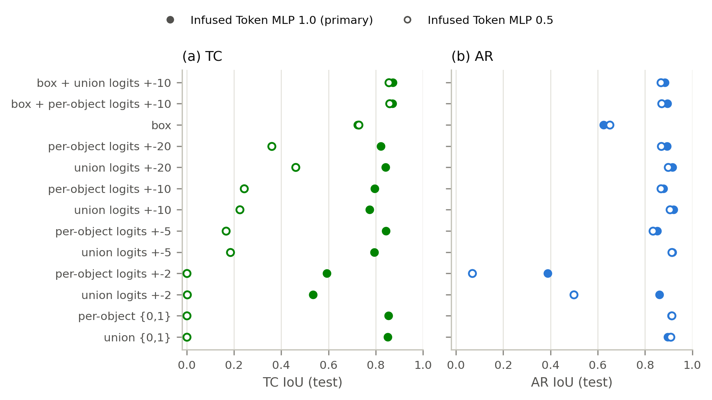
*Figure 5 — How the decoder reads dense mask prompts built from the ground truth: {0,1} maps vs. logit maps of scale
±a, one prompt per class ("union") vs. one per object, with and without a box. Filled: primary checkpoint;
open: MLP 0.5 checkpoint.*

Figure 5 reveals a checkpoint-dependent behaviour that explains several earlier observations. On the primary
checkpoint both {0,1} and logit masks work (TC 0.85, AR 0.90). On the MLP 0.5 checkpoint {0,1} masks produce *no* TC
at all (0.000) and even ±20 logits only reach TC 0.46, while AR is unaffected. The prompt encoder downsamples the
256×256 mask to 64×64, where a cyclone covers a handful of cells; whether the decoder learned to use such weak dense
evidence depends on its Phase-1 training. A box together with the mask is robust on both checkpoints (TC 0.86–0.87),
which is why the hybrid conversion uses boxes for TCs. One prompt per class works as well as one per object, so a
single decoder call per class is sufficient for dense prompts.

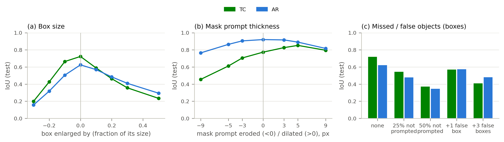
*Figure 6 — SAM with deliberately corrupted ground-truth prompts (primary checkpoint): (a) box size, (b) thickness of a
dense mask prompt, (c) missed and false objects.*

Figure 6 quantifies the sensitivity to the errors a real prompter makes:

- **Box size** (a): IoU peaks sharply at the tight box. Enlarging the boxes by 20 % costs 0.26 TC and 0.14 AR IoU;
  shrinking them by 20 % costs 0.30 / 0.31. The decoder takes the box extent literally.
- **Missed and false objects** (c): an object without a prompt is never recovered (25 % missed prompts:
  TC 0.723 → 0.548, AR 0.625 → 0.483), and a single random false box per class costs 0.149 TC / 0.047 AR IoU —
  the decoder segments *something* inside every box it is given.
- **Dense prompts are forgiving** (b): eroding the mask by 3 px costs only 0.07 TC / 0.02 AR, and dilating it by
  3–5 px even *improves* TC (0.774 → 0.852), because the prompt encoder's 4× downsampling otherwise weakens small
  objects.

**Answer to RQ1.** The Phase-1 SAM is an excellent *refiner* when the prompt is right (hybrid: 0.87 / 0.92), but it
does not correct prompts: detection errors pass through unchanged and box errors of 10–20 % already cost 0.1–0.3 IoU.

### 3.2 Re-check of Table 4.13 (RQ2)

We re-ran every configuration of Table 4.13 with the thesis pipeline itself (fine-tuned CG-Net, `PromptMaker`,
`ClimateSAM.infer` / `forward`) on the 61 test images, on both MLP 1.0 checkpoints, and along two image paths: the
path of `test_prompt_effect.py`, which calls `ClimateSAM.set_infer_img()` and thereby **skips the learned input
adapter** (it feeds the first three raw channels to the encoder), and the fixed training path (`encode_images()`).

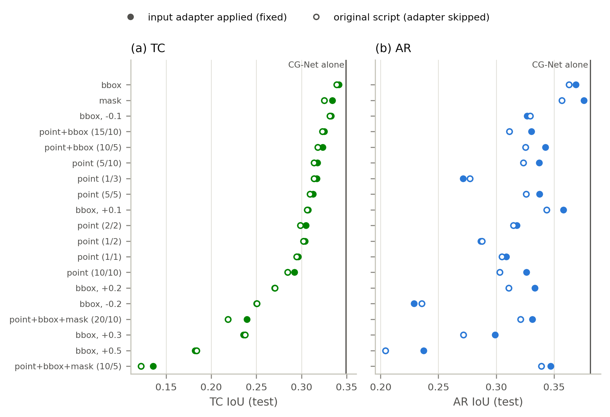
*Figure 7 — SAM with CG-Net as prompter, every configuration of Table 4.13 (primary checkpoint). Filled: input adapter
applied; open: original script. Vertical line: CG-Net alone. Labels: prompt type (positive / negative points),
box enlargement.*

| Prompt (primary checkpoint, fixed path) | IoU AR | IoU TC | Table 4.13 (thesis) AR / TC |
|---|---|---|---|
| CG-Net alone | 0.382 | 0.349 | 0.375 / 0.342 |
| bbox | 0.369 | 0.341 | **0.482 / 0.430** |
| point + bbox (10 / 5) | 0.343 | 0.324 | 0.461 / 0.422 |
| point (5 / 10) | 0.337 | 0.318 | 0.432 / 0.384 |
| bbox, enlarge +0.1 | 0.358 | 0.307 | 0.448 / 0.393 |
| mask ({0,1} noisy masks) | 0.376 | 0.334 | 0.048 / 0.000 |

(full table: `tables/table_4_13_corrected.tex`)

The re-run of the original script with the checkpoint used in the last run of `test_prompt_effect.py`
(`…_NOSMOOTH`) reproduces that run exactly (bbox: 0.3404 / 0.3758 vs. 0.3409 / 0.3758 in
`exp/CGTEST_VIT_B_MLP1/prompt_effect_results_20260410_221245.csv`), so the pipeline is faithfully reproduced — but the
SAM rows of Table 4.13 are 0.07–0.12 higher than the corresponding re-runs, and no file in the repository, the logs or wandb
contains them. They most likely stem from an earlier state of the code. The skipped input adapter is a real bug but
costs only 0.00–0.03 IoU. The "mask" row depends on the checkpoint (Section 3.1): 0.000 TC on the NOSMOOTH checkpoint,
0.334 on the primary one.

**Answer to RQ2.** The *ranking* in Table 4.13 holds (tight boxes > boxes + points > points; enlarging boxes hurts
monotonically), but its central claim does not: **SAM prompted by CG-Net is never better than CG-Net itself**
(best: tight boxes, −0.008 TC / −0.013 AR).

### 3.3 Comparison of all prompters (RQ3, RQ4)

**Table 1 — Prompters under one protocol (primary checkpoint, test set; mean ± std over 3 seeds, 2 for the CG-Net
re-trained from the official weights, the CG-block variant and the box head; official / fine-tuned CG-Net: fixed
checkpoints).** Best prompter mask in bold.

| Prompter | Output | TC IoU | AR IoU | Mean FG IoU |
|---|---|---|---|---|
| CG-Net (official) | prompter mask | 0.327 | 0.333 | 0.330 |
| | SAM + box / hybrid | 0.318 / 0.327 | 0.342 / 0.339 | 0.330 / 0.333 |
| CG-Net (fine-tuned) | prompter mask | 0.349 | 0.382 | 0.366 |
| | SAM + box / hybrid | 0.341 / 0.349 | 0.369 / 0.384 | 0.355 / 0.367 |
| CG-Net (re-trained, official init.) | prompter mask | 0.350 ± 0.005 | 0.399 ± 0.005 | 0.375 ± 0.005 |
| | SAM + box / hybrid | 0.345 / 0.348 | 0.387 / 0.400 | 0.366 / 0.374 |
| CG-Net (trained from scratch) | prompter mask | 0.343 ± 0.007 | 0.394 ± 0.008 | 0.369 ± 0.006 |
| | SAM + box / hybrid | 0.343 / 0.339 | 0.380 / 0.395 | 0.362 / 0.367 |
| LogReg, block 1 | prompter mask | 0.195 ± 0.001 | 0.319 ± 0.001 | 0.257 ± 0.001 |
| | SAM + box / hybrid | 0.200 / 0.213 | 0.321 / 0.316 | 0.260 / 0.264 |
| LogReg, block 12 | prompter mask | 0.301 ± 0.004 | 0.385 ± 0.001 | 0.343 ± 0.002 |
| | SAM + box / hybrid | 0.291 / 0.304 | 0.362 / 0.373 | 0.326 / 0.338 |
| MSF | prompter mask | 0.333 ± 0.002 | 0.403 ± 0.004 | 0.368 ± 0.003 |
| | SAM + box / hybrid | 0.339 / 0.330 | 0.385 / 0.388 | 0.362 / 0.359 |
| MSF + token gate | prompter mask | 0.324 ± 0.001 | 0.399 ± 0.003 | 0.362 ± 0.001 |
| | SAM + box / hybrid | 0.336 / 0.329 | 0.382 / 0.387 | 0.359 / 0.358 |
| MSF + token gate, CG blocks | prompter mask | 0.324 ± 0.017 | 0.355 ± 0.022 | 0.340 ± 0.003 |
| | SAM + box / hybrid | 0.289 / 0.322 | 0.335 / 0.391 | 0.312 / 0.356 |
| MSF + token gate, shared weights | prompter mask | 0.332 ± 0.006 | 0.402 ± 0.001 | 0.367 ± 0.003 |
| | SAM + box / hybrid | 0.338 / 0.333 | 0.385 / 0.391 | 0.362 / 0.362 |
| **MPG** | prompter mask | **0.344 ± 0.003** | **0.413 ± 0.001** | **0.379 ± 0.002** |
| | SAM + box / hybrid | 0.343 / 0.342 | 0.391 / 0.398 | 0.367 / 0.370 |
| MPG, label smoothing | prompter mask | 0.338 ± 0.009 | 0.412 ± 0.001 | 0.375 ± 0.005 |
| MPG, end-to-end via SAM | prompter mask | 0.335 ± 0.010 | 0.378 ± 0.019 | 0.356 ± 0.014 |
| | SAM + box / hybrid | 0.336 / 0.334 | 0.385 / 0.402 | 0.360 / 0.368 |
| MPG, two-stage | prompter mask | 0.338 ± 0.005 | 0.409 ± 0.002 | 0.374 ± 0.001 |
| | SAM + box / hybrid | 0.334 / 0.337 | 0.386 / 0.411 | 0.360 / 0.374 |
| MPG + raw CG-Net fields | prompter mask | 0.340 ± 0.001 | 0.409 ± 0.006 | 0.375 ± 0.004 |
| | SAM + box / hybrid | 0.340 / 0.337 | 0.387 / 0.399 | 0.363 / 0.368 |
| Box head on SAM features | filled boxes | 0.094 ± 0.014 | 0.156 ± 0.016 | 0.125 ± 0.001 |
| | SAM + box | 0.107 ± 0.017 | 0.303 ± 0.025 | 0.205 ± 0.004 |
| Learned static prompts (4 / class) | SAM | 0.237 ± 0.001 | 0.324 ± 0.008 | 0.280 ± 0.004 |
| Learned static prompts (16 / class) | SAM | 0.248 | 0.329 | 0.288 |

(All conversions: `tables/prompt_conversion_infused_mlp1.tex`; background and mean IoU: `tables/main_infused_mlp1.tex`.)

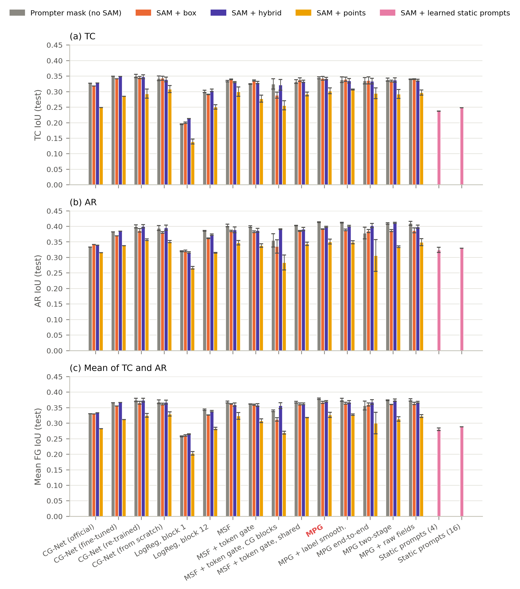
*Figure 8 — Prompter mask (grey) vs. SAM prompted by it with boxes (orange), hybrid prompts (violet) and points
(yellow); learned static prompts (magenta) have no prompter. Error bars: standard deviation over seeds.*

**Prompters.** The mask-prompt generator gives the best prompter mask. The paired bootstrap (Table 2) shows that its
advantage over the fine-tuned CG-Net lies entirely in the ARs (AR +0.031, CI [+0.020, +0.043]; TC −0.005,
CI [−0.030, +0.020]), and that it is better than MSF (+0.011 mean FG IoU, CI [+0.003, +0.019]) and than the linear
probe on the last ViT block (+0.036, CI [+0.025, +0.046]). The token gate *lowers* MSF slightly but significantly
(−0.006, CI [−0.009, −0.003]); since the gate inputs are the frozen decoder's fixed HQ tokens, the gate is merely a
learned per-class channel weighting and adds no image-dependent information. Label smoothing, which helped Phase 1,
does not help the prompter (−0.004, CI [−0.007, −0.000]). Remarkably, a linear classifier on the last ViT block
(1.5 k parameters) already reaches TC 0.301 / AR 0.385, close to the fine-tuned CG-Net, while the same classifier on
the first block — the thesis configuration — reaches only 0.195 / 0.319: the adapted encoder's late features are
linearly separable with respect to TC and AR, the early ones are not.

**CG-Net trained under the same protocol.** The fine-tuned CG-Net checkpoint was trained outside this protocol (on all
398 training images, including our validation images). Re-trained on the 358 training images with its original Jaccard
loss and validation-based selection, CG-Net is clearly better than the stored checkpoint: 0.375 mean FG IoU from the
official ClimateNet weights (2 seeds), 0.369 from scratch (3 seeds), against 0.366. Against these fair baselines MPG's
advantage shrinks to the ARs (AR +0.013 [+0.003, +0.024] and +0.018 [+0.009, +0.027]); TC is equal and the mean FG
difference (+0.004 and +0.010) is not significant. **A well-trained CG-Net on four raw fields is thus nearly as good a
prompter as a head on the adapted SAM encoder** — at 23 GFLOPs instead of ~980 (encoder + MPG). SAM does not improve
these masks either (hybrid −0.001, box −0.007 to −0.009).

**Further thesis prompters.** The token-gated MSF with context-guided blocks is clearly worse than the plain token gate
(0.340, −0.023 [−0.032, −0.015], mainly AR −0.046) and trains slowly (1.5–3.5 h per seed on cached features; selected
epochs 2 and 14). Its fragmented AR mask (20.5 AR objects per image) is the only case where SAM with hybrid prompts
clearly improves on the prompter (+0.017, AR +0.037) — still below MPG. The shared-weight variant is slightly better than
the token gate (0.367, +0.006 [+0.003, +0.009]) and below MPG (−0.011 [−0.020, −0.004]). The YOLO-style box head on the
SAM features is the weakest image-dependent prompter: SAM with its boxes reaches TC 0.107 / AR 0.303; it finds most TCs
(recall 0.81–0.93) but SAM's output then contains 9–17 TC objects per image, of which only 17–29 % touch a cyclone.

**MPG + raw fields.** Adding the four CG-Net fields to MPG (at 64² before the ConvNeXt blocks and at 256² before the
head, zero-initialised) makes it slightly *worse* (0.375, −0.004 [−0.008, −0.001]): the encoder already sees all 16
input channels through the input adapter, so the raw fields add no information the SAM features lack.

**Table 2 — Selected paired-bootstrap comparisons** (full list: `tables/bootstrap_infused_mlp1.tex`).

| Comparison (B − A) | Δ TC [95 % CI] | Δ AR [95 % CI] | Δ mean FG [95 % CI] |
|---|---|---|---|
| MPG vs. CG-Net (fine-tuned), masks | −0.005 [−0.030, +0.020] | **+0.031 [+0.020, +0.043]** | +0.013 [−0.000, +0.027] |
| MPG vs. MSF, masks | +0.011 [−0.003, +0.025] | +0.010 [+0.005, +0.016] | **+0.011 [+0.003, +0.019]** |
| MPG vs. CG-Net (re-trained, official init.), masks | −0.006 [−0.027, +0.015] | **+0.013 [+0.003, +0.024]** | +0.004 [−0.008, +0.016] |
| MPG vs. CG-Net (from scratch), masks | +0.001 [−0.018, +0.023] | **+0.018 [+0.009, +0.027]** | +0.010 [−0.002, +0.022] |
| MPG vs. LogReg block 12, masks | +0.044 [+0.025, +0.062] | +0.028 [+0.020, +0.036] | +0.036 [+0.025, +0.046] |
| MPG + raw fields vs. MPG, masks | −0.004 [−0.012, +0.002] | −0.004 [−0.007, −0.001] | −0.004 [−0.008, −0.001] |
| MSF + token gate vs. MSF, masks | −0.009 [−0.015, −0.003] | −0.004 [−0.005, −0.002] | −0.006 [−0.009, −0.003] |
| token gate + CG blocks vs. token gate, masks | −0.000 [−0.013, +0.014] | −0.046 [−0.060, −0.032] | −0.023 [−0.032, −0.015] |
| token gate, shared weights vs. token gate, masks | +0.008 [+0.002, +0.013] | +0.003 [+0.000, +0.006] | +0.006 [+0.003, +0.009] |
| MPG: SAM + box vs. its mask | −0.002 [−0.009, +0.006] | −0.022 [−0.028, −0.016] | −0.012 [−0.017, −0.007] |
| MPG: SAM + hybrid vs. its mask | −0.002 [−0.007, +0.003] | −0.015 [−0.024, −0.006] | −0.008 [−0.014, −0.003] |
| CG-Net (ft): SAM + box vs. its mask | −0.008 [−0.017, +0.001] | −0.013 [−0.018, −0.006] | −0.010 [−0.016, −0.004] |
| MPG end-to-end: SAM + hybrid vs. its mask | −0.001 [−0.005, +0.003] | +0.024 [+0.021, +0.028] | +0.012 [+0.009, +0.015] |
| MPG two-stage: SAM + hybrid vs. MPG mask | −0.007 [−0.013, −0.000] | −0.002 [−0.007, +0.003] | −0.004 [−0.008, −0.000] |
| Static prompts (4) vs. MPG mask | −0.107 [−0.142, −0.073] | −0.089 [−0.102, −0.077] | −0.098 [−0.117, −0.079] |

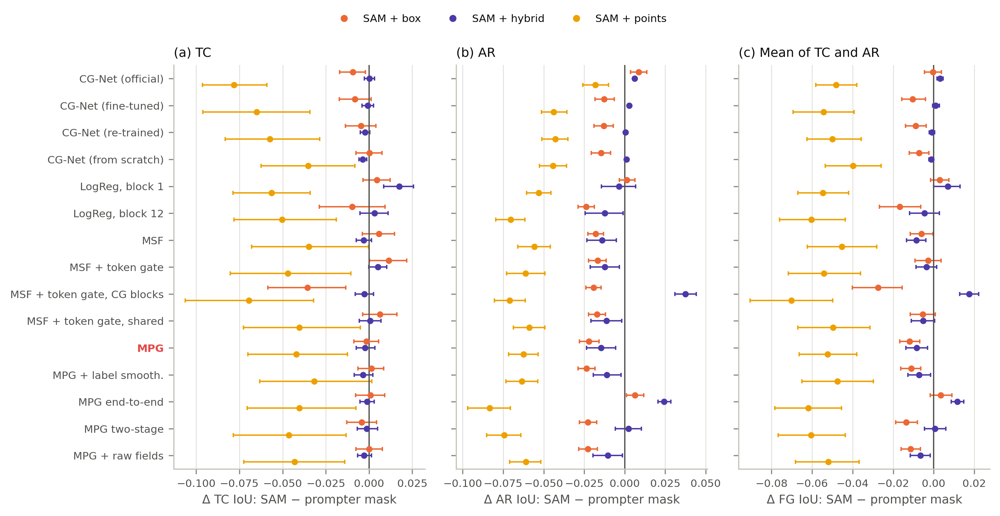
*Figure 9 — Effect of SAM: IoU of SAM's output minus IoU of the prompter's own mask, per prompter and prompt type,
with paired-bootstrap 95 % intervals over the 61 test images.*

**Added value of SAM.** Figure 9 answers the central question of Phase 2. Point prompts always lose (−0.03 to −0.08
mean FG IoU). Tight boxes are roughly neutral for TC (−0.010 … +0.011) and lose 0.013–0.024 AR IoU for every
prompter with a good AR mask (fine-tuned CG-Net, LogReg block 12, MSF, all MPG variants trained with the segmentation
loss); they are neutral or slightly positive only where the prompter's AR mask is poor (official CG-Net, LogReg
block 1, end-to-end MPG). The hybrid prompt is the best conversion: within about ±0.01 of the prompter mask for every
prompter (−0.009 … +0.012), slightly *positive* only for prompters whose own mask is poor (LogReg block 1: +0.007;
MPG end-to-end: +0.012) and slightly *negative* for the strong ones (MSF −0.009, MPG −0.008). Averaging the prompter's and SAM's probabilities behaves like the
hybrid output. The best SAM output of the whole study (MPG two-stage, hybrid: 0.374 mean FG IoU) does not exceed the
best prompter mask (MPG: 0.379).

**Training through SAM (RQ4).** Training MPG end-to-end through the frozen decoder makes *its own* mask worse
(0.356 vs. 0.379) and makes SAM's output better than that mask (+0.012) — the prompter learns to produce logits that
SAM turns into good masks — but the resulting SAM output (0.368) is still below the plain MPG mask (Table 2,
−0.011 [−0.016, −0.005]). The end-to-end mask is also strongly fragmented (90 AR objects per image, Table 3):
the SAM loss does not penalise speckle in the prompt as long as SAM ignores it. The two-stage variant nearly keeps the
MPG mask quality (0.374 vs. 0.379) and reaches the best SAM output of the study (hybrid 0.374), still not above the
MPG mask (−0.004 [−0.008, −0.000]). Its best validation epochs were 2–8 of 30: training through SAM barely changes
the prompter once it has been trained on its own maps.

**Answer to RQ3 and RQ4.** The best prompter is the small mask-prompt generator; SAM prompted by any prompter is at
best as good as that prompter, and training the prompter through SAM does not change this.

### 3.4 Where the IoU is lost (RQ5)

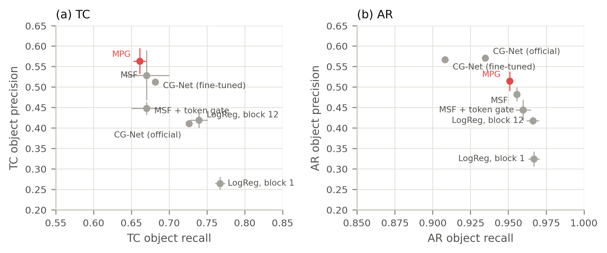
*Figure 10 — Object-level recall and precision of the prompter masks (mean over seeds, bars: std).*

**Table 3 — Object level (prompter masks).** Ground truth: 2.9 TC and 6.8 AR objects per test image.

| Prompter | TC recall | TC precision | AR recall | AR precision | TC / AR objects per image |
|---|---|---|---|---|---|
| CG-Net (fine-tuned) | 0.682 | 0.513 | 0.908 | 0.567 | 3.9 / 11.9 |
| LogReg, block 12 | 0.739 | 0.419 | 0.966 | 0.418 | 5.1 / 17.6 |
| MSF | 0.670 | 0.529 | 0.956 | 0.482 | 4.0 / 17.4 |
| MPG | 0.661 | 0.563 | 0.951 | 0.514 | 3.5 / 14.9 |
| MPG end-to-end | 0.652 | 0.521 | 0.963 | 0.362 | 3.7 / 90.0 |

All prompters find more than 90 % of the ARs but only two thirds of the TCs, and 40–60 % of their predicted blobs do
not touch any ground-truth object. For ARs many of these are small fragments (12–18 predicted AR objects per image
vs. 6.8 in the ground truth).

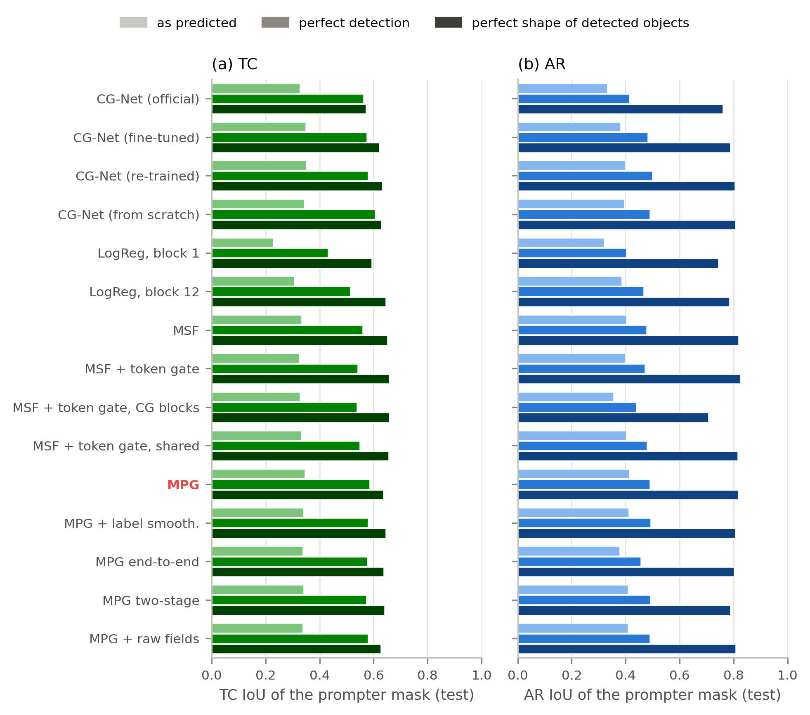
*Figure 11 — IoU of the prompter mask as predicted, with perfect detection (false objects removed, missed objects
added), and with the true shape of every detected object (false objects kept).*

The decomposition separates *detection* from *delineation* (Table `tables/error_decomposition_infused_mlp1.tex`):

- **AR.** For MPG, perfect detection raises AR IoU only from 0.413 to 0.490, but giving every *detected* river its true
  shape raises it to **0.817**. The ARs are found; what is wrong is their extent (length, width, where a river ends).
- **TC.** Perfect detection (0.345 → 0.585) and perfect shapes of the detected cyclones (→ 0.636) matter about equally:
  a third of the cyclones is missed, half of the predicted blobs are false, and the small objects are also
  delineated imprecisely.

These are exactly the errors SAM cannot fix (Section 3.1): missed objects stay missed, false prompts become false
objects, and the extent of an AR is taken from the prompt (a box) or copied from it (a dense mask). This is the
mechanistic reason for the result of Section 3.3.

### 3.5 Training dynamics and efficiency

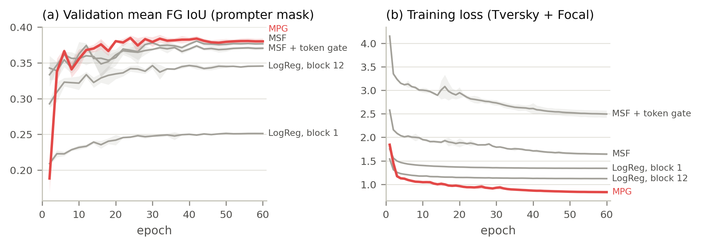
*Figure 12 — Validation mean FG IoU of the prompter mask and training loss (mean ± std over three seeds). The loss
values are not comparable across architectures: the MSF models add deep-supervision terms.*

MPG reaches its plateau within 10–15 epochs (selected epochs 24–32) and overfits little; the MSF models learn more
slowly (selected epochs 30–42), and the linear probes saturate early at a lower level. With cached features a complete MPG training takes
3.7 min, an MSF training 46–83 min (Table `tables/cost_infused_mlp1.tex`).

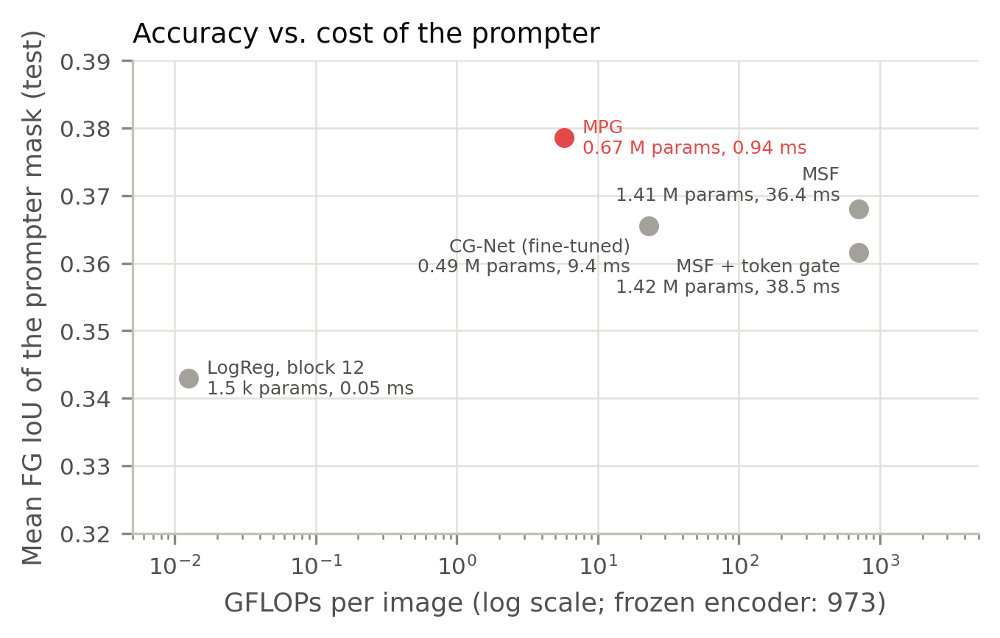
*Figure 13 — Accuracy of the prompter mask vs. forward cost (log scale).*

MPG is both the most accurate and one of the cheapest prompters: 5.7 GFLOPs and 0.9 ms per image, i.e. **122× fewer
FLOPs and 40× lower latency than MSF** and 4× fewer FLOPs than CG-Net, which additionally needs its own input
pipeline. Relative to the frozen encoder (973 GFLOPs) the prompter adds 0.6 %. MSF spends almost all its computation
on 3×3 convolutions at 1024² over features that were nearest-neighbour upsampled from 64², i.e. on resolution that
contains no additional information.

### 3.6 Adapting SAM's decoder to generated prompts (RQ4)

The Phase-1 decoder has only ever seen perfect prompts. We fine-tuned its trainable HQ parts (`hf_mlp_ar/tc`,
`compress_vit_feat`, `embedding_encoder`, `embedding_maskfeature`; 1.21 M parameters — the same set Phase 1 trained,
except `hf_token_ar/tc`, which the encoder's token adapters share) on the prompts a frozen prompter produces, with the
union of the prompted masks trained against the full ground truth, 30 epochs, lr $3\cdot10^{-4}$, selection on
validation. A prompter is much better on the images it was trained on than on new images (the fine-tuned CG-Net saw
all training images: validation mean FG IoU 0.45 vs. 0.37 on test), so a decoder trained on such prompts would learn
to trust unrealistically clean prompts. The **out-of-fold** variant avoids this: five copies of MPG are trained, each
without one fifth of the training images, and every training image receives its prompts from the copy that never
saw it.

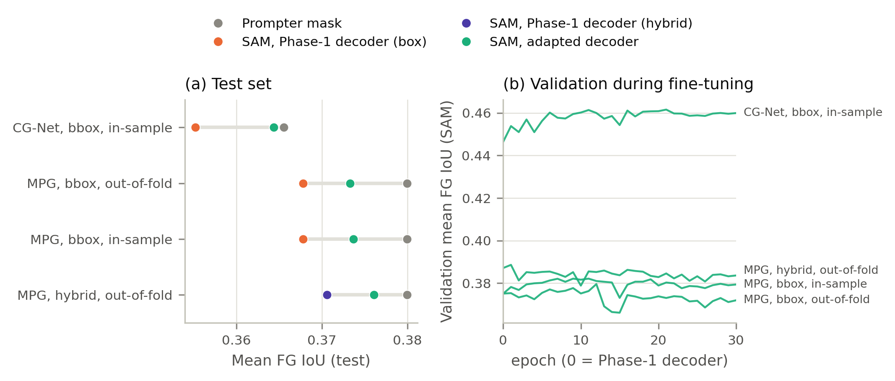
*Figure 14 — (a) Test mean FG IoU of the prompter mask, SAM with the Phase-1 decoder and SAM with the adapted decoder;
(b) validation IoU during fine-tuning (epoch 0 = Phase-1 decoder; the CG-Net curve is high because CG-Net was trained
on these images).*

| Prompter, prompts, training prompts | Prompter mask | SAM, Phase-1 decoder | SAM, adapted decoder | AR object precision (Phase-1 → adapted) |
|---|---|---|---|---|
| CG-Net, box, in-sample | 0.366 | 0.355 | 0.364 | 0.53 → 0.58 |
| MPG, box, in-sample | 0.380 | 0.368 | 0.374 | 0.50 → 0.55 |
| MPG, box, out-of-fold | 0.380 | 0.368 | 0.373 | 0.50 → 0.62 |
| MPG, hybrid, out-of-fold | 0.380 | 0.371 | 0.376 | 0.65 → 0.64 |

(mean FG IoU, test; MPG seed 0.) The adapted decoder does learn something useful — it rejects part of the false AR
prompts (AR object precision 0.50 → 0.62 with out-of-fold boxes) — and it recovers most of what SAM loses relative to
the prompter. In no configuration, however, does SAM end up above the prompter mask (best: −0.004); on the second
checkpoint the best configuration ties it (+0.001), and out-of-fold boxes even hurt (0.353 vs. 0.376). The limiting
factor is therefore not the distribution of training prompts but that the decoder cannot recover missed objects or
infer the extent of an AR better than the prompter already did.

**Prompt-robust decoder.** To attack the cause identified in Section 3.1 directly, the same decoder parts were trained
on *corrupted* ground-truth prompts mixed 1:1 with out-of-fold MPG prompts (25 epochs, lr 3·10⁻⁴, 2 seeds per mode):
every object is left unprompted with p = 0.15, box sides move by U(−0.15, 0.3) of the box size, Binomial(3, 0.25) false
boxes are added per class, dense prompts are eroded / dilated (kernel ≤ 5×5 px) and get a false blob with p = 0.3. The
target of a box is the *complete* ground-truth object(s) it touches — and an empty mask for a box touching nothing — so
the decoder is taught to say "nothing here" and to extend or shrink a prompt (`prompter_bench/train_robust_decoder.py`).

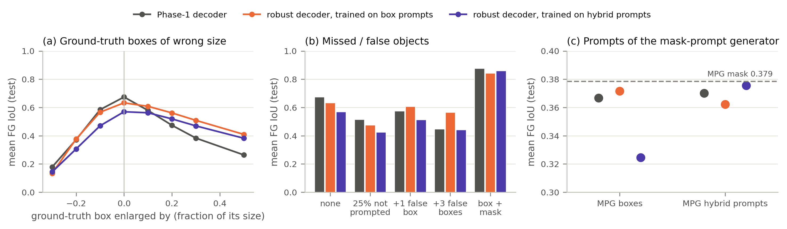
*Figure 14b — Prompt-robust decoders (mean of two seeds) vs. the Phase-1 decoder: (a, b) ground-truth prompts with
controlled errors, (c) prompts of MPG; dashed: MPG's own mask.*

| Decoder (mean FG IoU, test) | GT box | GT box +20 % | GT box + 1 false | GT box + mask | MPG: box | MPG: hybrid | CG-Net: box | CG-Net: hybrid |
|---|---|---|---|---|---|---|---|---|
| Phase-1 decoder | 0.674 | 0.474 | 0.576 | 0.877 | 0.367 | 0.370 | 0.355 | 0.367 |
| robust, box (seeds 0 / 1) | 0.630 / 0.636 | 0.559 / 0.564 | 0.609 / 0.608 | 0.838 / 0.847 | 0.371 / 0.372 | 0.360 / 0.364 | 0.363 / 0.365 | 0.368 / 0.369 |
| robust, hybrid (seeds 0 / 1) | 0.592 / 0.548 | 0.511 / 0.527 | 0.524 / 0.503 | 0.856 / 0.867 | 0.332 / 0.317 | 0.375 / 0.376 | 0.320 / 0.309 | 0.367 / 0.369 |
| corrupted GT only, last epoch | 0.517 | 0.468 | 0.477 | 0.881 | 0.291 | 0.360 | 0.287 | 0.367 |

(`tables/robust_decoder_infused_mlp1.tex`; the oracle study of every decoder: `01_oracle_prompts/oracle_sweep_infused_mlp1@<decoder>.csv`.)

- **Robust to synthetic box errors — yes.** In box mode the decoder loses much less on enlarged boxes (+20 %:
  0.474 → 0.56) and on false boxes (0.576 → 0.61), at the price of tight boxes (0.674 → 0.63): it no longer takes the
  box extent literally.
- **Transfer to real prompters — hardly.** SAM with MPG boxes gains +0.005 [+0.002, +0.008], with CG-Net boxes
  +0.008–0.010. In hybrid mode SAM with MPG hybrid prompts gains +0.005–0.006 [+0.004, +0.007] to 0.375–0.376 — still
  below MPG's own mask (−0.003 to −0.004 [−0.006, −0.000]) and the same gain as the plain out-of-fold adaptation above.
- **Specialisation.** Each decoder is worse with the other prompt mode (hybrid-trained with MPG boxes −0.035 to −0.050;
  box-trained with hybrid prompts −0.006 to −0.010).
- **Synthetic corruption alone does not help.** Without MPG prompts in training, the validation IoU with MPG prompts
  falls every epoch (0.387 → 0.37), so selection keeps the Phase-1 decoder; the last-epoch decoder is worse with real
  prompts (MPG hybrid −0.010, MPG boxes −0.076) and unchanged on ground-truth prompts of its own mode (box + mask 0.881).
  Hand-designed corruptions do not reproduce the errors of a real prompter.

The robust decoder therefore does what it was trained for on synthetic errors, but SAM still does not exceed its
prompter: the errors that remain after a good prompter — missed cyclones and the extent of rivers — cannot be corrected
from a prompt that does not contain the information.

### 3.7 Prompt-free SAM without a prompter: learned static prompts

The most minimal prompt-free variant learns K sparse prompt tokens per class (initialised from SAM's positive-point
embedding) that are fed to the frozen decoder for every image; all image-specific information must come from the
decoder's attention to the image embedding. With K = 4 this reaches TC 0.237 / AR 0.324 (3 seeds, ±0.001 / ±0.008),
with K = 16 TC 0.248 / AR 0.329 — 0.09–0.10 mean FG IoU below MPG. Object recall is high (TC 0.87, AR 0.98) but
precision is ~0.2: the output breaks into thousands of fragments (813 TC and 3,698 AR objects on the 61 test images,
Figure 17 h). A fixed query cannot decide *which* humid, windy region is a TC or AR; this decision needs an
image-dependent prompter.

### 3.8 CG-Net with a YOLO box head

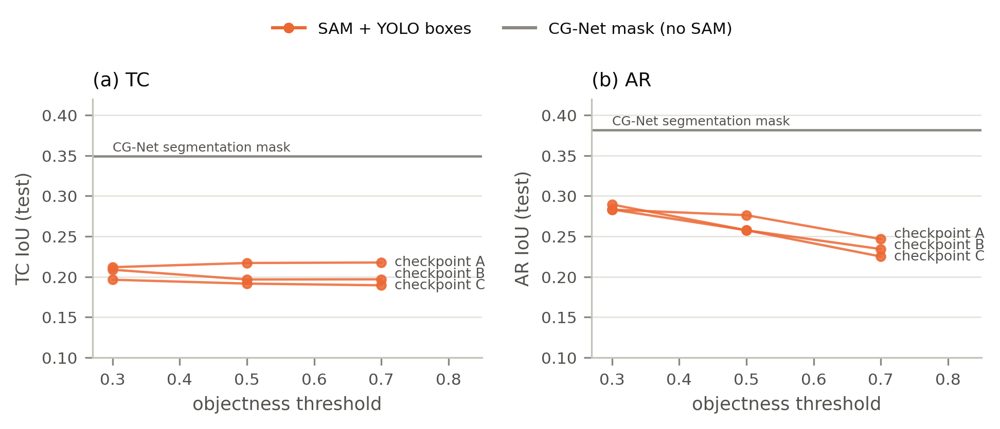
*Figure 15 — SAM prompted by the boxes of the thesis' CG-Net YOLO head (three saved checkpoints A–C) as a function of
the objectness threshold; grey line: CG-Net's segmentation mask.*

Boxes predicted directly by a grid detector are the weakest prompts of the study (SAM: TC 0.19–0.22, AR 0.22–0.29),
far below boxes derived from a segmentation (0.34 / 0.37 with CG-Net's masks). Filling the boxes gives TC ≈ 0.16 / AR ≈ 0.15: the boxes are too loose
for thin, curved ARs, and Section 3.1 showed that 20 % box error already costs 0.14–0.26 IoU. A higher threshold trades
recall for precision without changing the picture (`03_cgnet_yolo_boxes/`).

### 3.9 Robustness: second frozen checkpoint

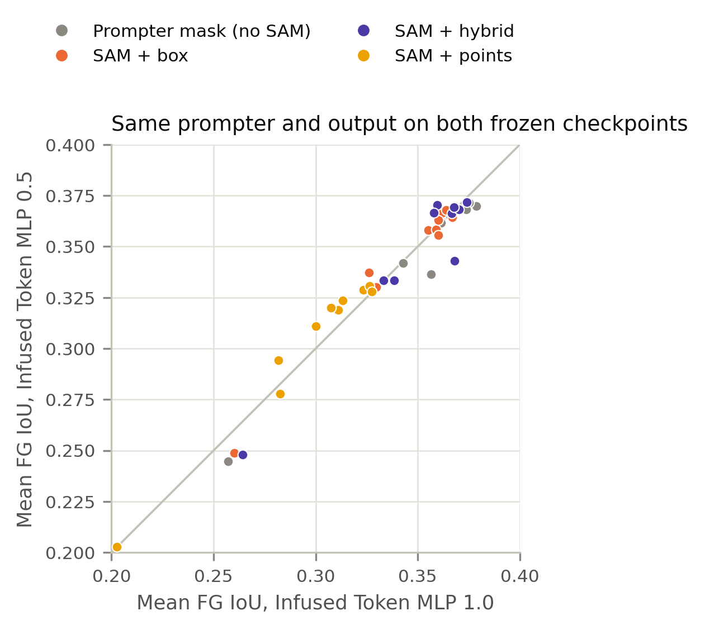
*Figure 16 — Mean FG IoU of every prompter × output on the MLP 1.0 (x) and MLP 0.5 (y) checkpoints. Diagonal: equal.*

All results were repeated on the MLP 0.5 checkpoint (`tables/main_infused_mlp05.tex`; MSF models one seed). The points
lie close to the diagonal (Figure 16): the conclusions do not depend on the checkpoint. On this checkpoint MPG
(0.370) ties MSF (0.370) and the smoothed MPG (0.371); all three remain ahead of CG-Net (0.366, AR +0.027…+0.028) and
the linear probe (0.342), and again no SAM output exceeds the best prompter mask (best SAM output 0.373 vs. 0.371,
within noise).

### 3.10 Qualitative examples

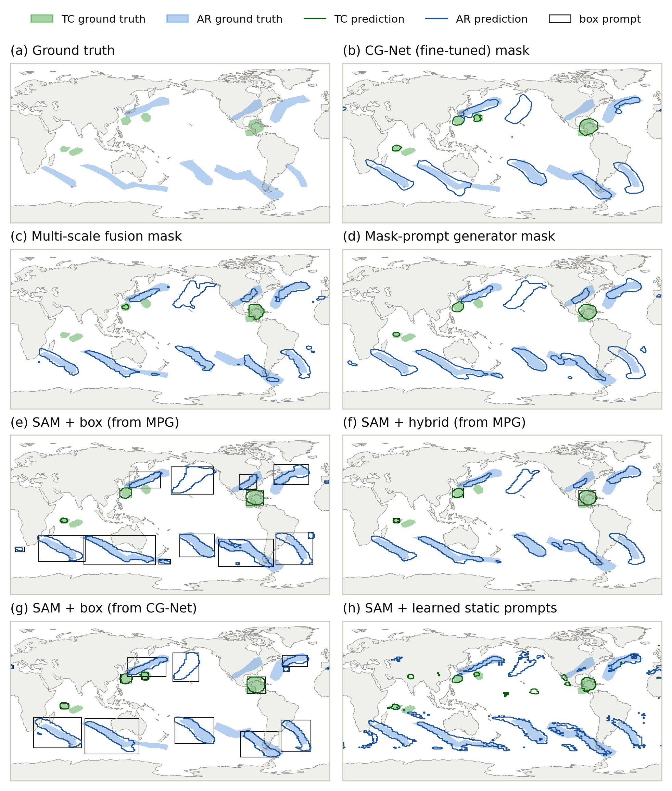
*Figure 17 — Test image 17. Filled: ground truth (TC green, AR blue); outlines: prediction; black rectangles: box
prompts. (b–d) prompter masks; (e, f) SAM prompted by MPG with boxes / hybrid prompts; (g) SAM prompted by CG-Net
boxes; (h) SAM with learned static prompts.*

Figure 17 illustrates the quantitative findings. All prompters find the long southern-hemisphere rivers and the large
Gulf-of-Mexico cyclone; they differ in the extents of the rivers and in small false or missed objects. SAM with boxes
(e, g) fills each box with a river-shaped mask — including the false AR over the central North Pacific that the
prompters hallucinated — and cuts rivers at the box borders; the hybrid prompt (f) follows the prompter's shape closely.
The learned static prompts (h) mark every moist band. (A second example: `figures/maps_test_image_45.png`.)

### 3.11 Evaluation-only improvements: ensembles, calibration, post-processing, iterative refinement

All free parameters tuned on the 40 validation images (`prompter_bench/posthoc.py`, `06_posthoc/`,
`tables/posthoc_infused_mlp1.tex`); Δ = paired bootstrap against the seed-0 prompter mask.

| Prompter | single seed | 3-seed ensemble | + calibrated thresholds | + post-processing | SAM hybrid round 1 / 2 / 3 |
|---|---|---|---|---|---|
| MPG | 0.379 | **0.385** (Δ +0.006 [+0.001, +0.010]) | 0.383 | 0.384 | 0.369 / 0.366 / 0.359 |
| MSF | 0.368 | 0.376 | 0.375 | 0.375 | 0.361 / 0.359 / 0.355 |
| MSF + token gate | 0.362 | 0.368 | 0.367 | 0.362 | 0.354 / 0.351 / 0.345 |
| LogReg, block 12 | 0.343 | 0.344 | 0.344 | 0.341 | 0.330 / 0.326 / 0.322 |
| CG-Net (from scratch) | 0.369 | 0.380 | 0.382 | 0.381 | 0.368 / 0.364 / 0.359 |
| MPG + raw fields | 0.375 | 0.382 | 0.380 | 0.382 | 0.369 / 0.365 / 0.358 |
| **MPG + CG-Net (3 + 3 models)** | — | **0.389** (TC 0.363 / AR 0.416) | 0.391 | 0.388 | 0.370 / 0.367 / 0.362 |

(mean FG IoU, test)

- **Seed ensembles** add 0.006–0.011 for every non-linear prompter (+0.015 for end-to-end MPG, whose seeds differ most;
  mainly TC for the SAM-feature prompters, both classes for CG-Net); the linear probe's seeds converge to the same
  classifier and gain nothing.
- **Threshold calibration and post-processing** (minimum blob size, TC latitude limit) chosen on 40 validation images do
  not transfer to the test set (−0.005 … +0.002): the selected TC thresholds scatter between logit −1.0 and +2.75, i.e.
  they fit validation noise.
- **Iterative SAM refinement** (SAM's output fed back as the next prompt) loses in every round — the oracle finding
  (Section 3.1) applied repeatedly.
- **Ensembling across prompter families** (3 MPG + 3 CG-Net) gives the best mask of the study, 0.389. Relative to the
  MPG ensemble the gain is in the TCs (+0.010 [−0.005, +0.024]); relative to the CG-Net ensemble it is significant
  (+0.010 [+0.004, +0.016]). SAM-feature and raw-field prompters make partly different TC errors. (Six models vs. three;
  the gain over the MPG ensemble, +0.004 [−0.005, +0.012], is not significant.)

---

## 4. Discussion

### 4.1 Why SAM cannot improve on its prompter

The central finding — SAM with automatic prompts is bounded by the prompter — follows from what the Phase-1 decoder was
trained to do. It learned $p(\text{mask}\mid\text{image},\text{prompt})$ with prompts that were always correct:
every box contained exactly one object, and the box extent was the object's extent. Under that training distribution,
the optimal decoder *trusts* the prompt: it segments whatever lies in the box and never has a reason to output nothing
or to extend a mask beyond its prompt. The oracle experiments confirm this behaviour directly (Figure 6). A prompter's
errors are of exactly these kinds — false objects, missed objects, wrong AR extents (Figures 10, 11) — so they pass
through SAM unchanged. What SAM *can* add is boundary quality inside a correct prompt, but for ARs the dominant error is
the extent of the whole river, not its boundary pixels, and for TCs the objects are small enough that detection
dominates.

The decoder adaptation experiment (Section 3.6) shows that this is not only a matter of training distribution: even a
decoder trained on realistic, out-of-fold prompts learns to reject some false prompts but cannot add information the
prompt does not contain. The prompter and SAM share the same frozen image embedding; whatever the decoder could infer
about an AR's extent from that embedding, a prompter trained directly on the labels infers as well.

A further reason lies in the labels. ClimateNet's labels are the consensus of several experts, and the thesis' Table
2.1 reports a *mean expert performance* of AR 0.341 / TC 0.257 IoU against that consensus [18]. All good prompters here
(TC 0.33–0.35, AR 0.38–0.41) already exceed the average single expert. The remaining errors — AR extent, where exactly
a river starts and ends, weak cyclones — are precisely where experts disagree, so part of the gap to the oracle is
irreducible label ambiguity rather than a model deficiency.

### 4.2 Why a small generator beats the larger ones

The encoder's features describe the image on a 64×64 grid (16×16-pixel patches of the 1024² input). The ground truth,
in contrast, is 768×1152, but its information content at object boundaries is limited by expert ambiguity. MSF upsamples
the features by nearest-neighbour interpolation to 1024² and runs most of its 702 GFLOPs there; this cannot create
information and makes the model slow to train. MPG spends its capacity where the information is — at 64×64, with a
receptive field of ~15 patches from dilated convolutions on top of the encoder's own global attention — and uses two
learned upsampling steps only to reach the 256×256 resolution that SAM's dense prompt needs. The strong linear probe on
the last ViT block (Section 3.3) supports this view: the adapted encoder has already done most of the work, and the
prompter mainly needs to aggregate context and denoise.

### 4.3 Lessons for prompt design

(1) If sparse prompts are used, they must be tight boxes derived from a segmentation; points and loose or detector
boxes are harmful. (2) Dense prompts are more robust to prompt errors and carry the AR shape, but must be passed as
logits in the value range the decoder was trained with, and small TCs need an accompanying box on checkpoints whose
decoder ignores weak dense evidence. (3) One dense prompt per class is sufficient, which makes SAM decoding cheap
(one decoder call per class and image instead of one per object).

### 4.4 Implications for the thesis

For the prompt-free system, the prompter's own mask is the natural output (MPG: TC 0.344 / AR 0.413, mean IoU 0.567
including background). SAM with hybrid prompts gives masks of statistically similar quality (−0.008 mean FG IoU) with
smoother, SAM-style boundaries and adds 2 decoder calls per image. The contribution of the foundation model is thus
the *encoder*: its adapted features let a 0.67 M-parameter head match a dedicated segmentation network trained under
the same protocol (0.379 vs. 0.369–0.375; better for ARs by 0.013–0.018) and a linear probe come within ~0.03 of it.
In cost, however, CG-Net needs 23 GFLOPs per image, encoder + MPG ~980: for a purely automatic system a well-trained
small network is the cheaper choice at nearly the same quality, and the two are complementary (their ensemble: 0.389).
The promptable decoder is valuable for interactive use (Table 4.12: TC 0.72 / AR 0.63–0.64 with ground-truth boxes,
which a human annotator could provide) but not as a refinement stage after an automatic prompter.

### 4.5 Limitations and threats to validity

- **Small test set.** 61 images; differences below ~0.01 are within the bootstrap intervals and should not be
  interpreted. Model selection uses only 40 validation images, which were drawn from the same years as the training
  images (temporal correlation may make validation slightly optimistic, but it does not touch the test set).
- **Seeds.** Three seeds per learned configuration on the primary checkpoint; the MSF models on the second checkpoint
  were run with one seed. Seed variance (std 0.001–0.01) is small compared with image-sampling variance.
- **Two frozen checkpoints only.** Both are Infused-Token ViT-B models; LoRA-adapted or ViT-L encoders were not tested
  in Phase 2.
- **Fixed thresholds.** All masks use logit 0 (probability 0.5). Per-class thresholds tuned on the validation images were
  tested (Section 3.11) and changed the test IoU by −0.005 … +0.002.
- **External prompter trained on all images.** The fine-tuned CG-Net saw all 398 training images (including our
  validation images); this matters only for experiments that use its outputs on training images (Section 3.6). The
  CG-Net re-trained from the official ClimateNet weights inherits this (its validation selection is optimistic, its test
  numbers are not); the CG-Net trained from scratch is fully clean.
- **Object metrics.** "Found" / "correct" require only an overlap of one pixel; stricter matching criteria (IoU ≥ 0.5)
  would lower all recalls and precisions but not change the comparison.
- **Table 4.13.** We can show that the published SAM rows do not reproduce with the current code and checkpoints; we
  cannot identify their origin.

---

## 5. Conclusions

- **RQ1.** With perfect prompts the Phase-1 SAM reaches TC 0.87 / AR 0.92 (hybrid prompts) — encoder and decoder
  adaptation work. SAM does not correct prompts: missed objects stay missed, false prompts become false objects, and
  10–20 % box error costs 0.1–0.3 IoU.
- **RQ2.** The SAM rows of Table 4.13 do not reproduce; SAM prompted by CG-Net is slightly worse than CG-Net for every
  prompt type. The ranking of prompt types is confirmed.
- **RQ3.** The new mask-prompt generator (0.67 M parameters, 5.7 GFLOPs) is the best single prompter: TC 0.344 /
  AR 0.413, +0.011 mean FG IoU over the 1.41 M-parameter multi-scale fusion generator at 122× fewer FLOPs, and AR
  +0.031 over the stored fine-tuned CG-Net. Against CG-Net re-trained under the same protocol (0.369–0.375) it is better
  only for ARs (+0.013 to +0.018); the overall difference is not significant. The token gate (and its CG-block
  variant), label smoothing, end-to-end training and adding the raw fields do not help; a box head on SAM features is
  far worse. Seed ensembles add ~0.006; an ensemble of MPG and CG-Net gives the best mask (0.389).
- **RQ4.** SAM prompted by any automatic prompter is at best as good as that prompter. Neither training the prompter
  through SAM, nor fine-tuning the decoder on realistic out-of-fold prompts, nor training it to be robust to corrupted
  prompts (robust to synthetic box errors, +0.005 with real prompts), nor iterative refinement changes this.
- **RQ5.** ARs are found (> 90 %) but their extent is wrong; TCs are missed (one third) and falsely detected (about
  half of the predicted blobs). These are errors that a prompt-conditioned decoder cannot repair.

---

## 6. Ideas for further experiments

**Done in the final runs** (Sections 3.3, 3.6, 3.11): the decoder-side version of idea 1 (a prompt-robust decoder
trained on corrupted and out-of-fold prompts — robust to synthetic errors, +0.005 with real prompts), threshold
calibration and seed ensembling (ensemble +0.006, calibration no gain), object post-processing (no gain) and iterative
SAM refinement (loses every round). Still open, ranked by expected benefit relative to effort:

1. **Ensemble / fuse the two prompter families (cheap).** The MPG + CG-Net ensemble is the best mask (0.389). A single
   model with both inputs did *not* help (MPG + raw fields, −0.004), so the gain comes from model diversity, not from
   the fields; a larger same-family ensemble (6 MPG seeds) is the missing control.
2. **Train Phase 1 with realistic prompts (~1 day).** The robust decoder was trained only in Phase 2 (decoder parts,
   frozen prompt encoder). Mixing corrupted and prompter prompts into Phase-1 training (encoder adapters and prompt
   encoder trainable) is the stronger version. Given Section 3.6 the expected gain for automatic prompting is small; the
   benefit would be a more forgiving interactive tool.
3. **Query-based prompt-free decoding (~2–3 days).** Replace static prompts by *image-dependent* object queries
   (DETR / Mask2Former style): a small transformer on the image embedding predicts N query tokens with an objectness
   score, each decoded by the SAM decoder, trained with a matching (Hungarian) loss. This targets the TC detection
   errors directly.
4. **Joint fine-tuning of encoder adapters and prompter (~1 day).** Unfreeze the infused-token adapters (and input
   adapter) together with MPG, trained on the segmentation loss; the linear-probe result shows how much the encoder
   already contributes.
5. **Longitude wrap-around and test-time augmentation (~0.5 day).** ClimateNet is periodic in longitude; circular
   padding in the prompter and averaging predictions over longitudinally rolled inputs (requires re-encoding) would fix
   ARs and TCs cut at the date line.
6. **Stricter object metrics.** Object recall / precision at IoU ≥ 0.3 / 0.5 (matched objects) and event counts per
   image, as in ClimateNet papers.

---

## Appendix A — Bugs found in the original code

1. `test_prompt_effect.py` decodes images via `ClimateSAM.set_infer_img()`, which feeds the first three raw channels
   to the encoder and skips the learned input adapter (`encode_images()` applies it). Effect: −0.00…−0.03 IoU.
2. Multi-scale generators (`model/prompt_generator*.py` + `compute_generator_loss`): three output channels, of which
   only TC and AR are supervised (as independent sigmoids); the untrained background channel takes part in the final
   3-channel argmax.
3. `LogisticRegressionPrompter` classifies `feat_list[0]`, the first ViT block, instead of the last.
4. `StreamSegMetrics.update(pred, gt)` is called with swapped arguments in several scripts (signature
   `update(gt, pred)`); IoU is symmetric and unaffected, mean / frequency-weighted accuracies are affected.
5. All original training scripts select the best epoch on the test set.
6. The official ClimateNet CG-Net checkpoint (`pretrained/weights_cgnet.pth`) predicts background everywhere in
   `eval()` mode because its stored BatchNorm running statistics do not match its weights; it works with batch
   statistics (used here).
7. The fine-tuned CG-Net (`exp/cgnet_weight.pth`) was trained on all 398 training images; its outputs on training
   images are optimistic.

## Appendix B — Figure index

All figures: `results/figures/<name>.{png,pdf}`; separate panels: `results/figures/panels/<name>_<panel>.{png,pdf}`.
Colours follow one grammar throughout: TC green, AR blue (fill = ground truth, outline = prediction on maps);
prompter mask grey, SAM + box orange, SAM + hybrid violet, SAM + points yellow, learned static prompts magenta,
adapted decoder aqua; the proposed MPG in red, other methods grey. The palettes were checked for colour-vision
deficiency with a palette validator.

| Figure | File | Separate panels |
|---|---|---|
| 1 | `diagram_benchmark_pipeline` | — |
| 2 | `diagram_mask_prompt_generator` | — |
| 3 | `diagram_training_modes` | `_seg`, `_e2e`, `_twostage` |
| 4 | `oracle_prompt_types` | — |
| 5 | `oracle_mask_format` | `_tc`, `_ar` |
| 6 | `oracle_prompt_errors` | `_box_size`, `_mask_morphology`, `_objects` |
| 7 | `table_4_13_recheck` | `_tc`, `_ar` |
| 8 | `prompters_mask_vs_sam` | `_tc`, `_ar`, `_fg` |
| 9 | `sam_minus_prompter` | `_tc`, `_ar`, `_fg` |
| 10 | `object_level` | `_tc`, `_ar` |
| 11 | `error_decomposition` | `_tc`, `_ar` |
| 12 | `training_curves` | `_val`, `_loss` |
| 13 | `efficiency` | — |
| 14 | `decoder_adaptation` | `_test`, `_val` |
| 14b | `robust_decoder` | `_box_size`, `_objects`, `_real_prompts` |
| 15 | `cgnet_yolo` | `_tc`, `_ar` |
| 16 | `second_checkpoint` | — |
| 17 | `maps_test_image_17` (and `_45`) | `_gt`, `_cgnet`, `_msf`, `_mpg`, `_mpg_sam_box`, `_mpg_sam_hybrid`, `_cgnet_sam_box`, `_static` |
| B1 | `exploratory_runs` | `_sam`, `_generator` |

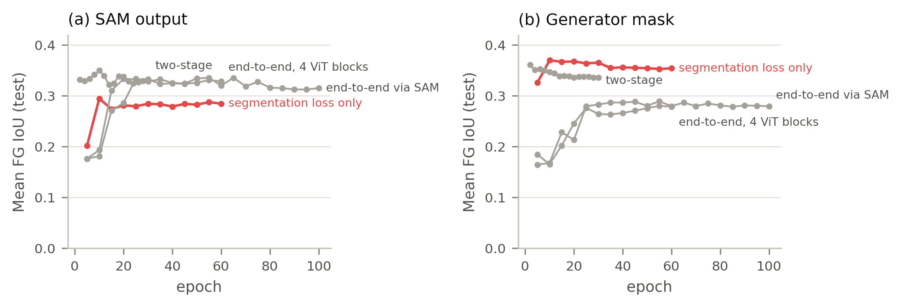
*Figure B1 — First exploratory runs of the mask-prompt generator (different checkpoint, BCE + Tversky loss, selection on
the test set; `07_exploratory_runs/`). They motivated the controlled benchmark: training through SAM from scratch was
worse than the segmentation loss for the generator mask, and SAM prompted by un-calibrated logits was poor.*

## Appendix C — Reproducibility

```bash
cd ClimateSAM
.venv/bin/python prompter_bench/encoder_check.py                               # checkpoint selection
.venv/bin/python prompter_bench/build_cache.py infused_mlp1 infused_mlp05      # encoder features (≈35 GB each)
.venv/bin/python prompter_bench/oracle_sweep.py --encoder infused_mlp1         # Section 3.1
.venv/bin/python prompter_bench/table413_recheck.py                            # Section 3.2
bash prompter_bench/run_queue.sh infused_mlp1 light; bash prompter_bench/run_queue.sh infused_mlp1 heavy   # prompters
bash prompter_bench/run_extra.sh infused_mlp1                                  # folds, label smoothing, decoder adaptation
bash prompter_bench/run_learned_prompt.sh infused_mlp1                         # learned static prompts
.venv/bin/python prompter_bench/yolo_eval.py                                   # Section 3.8
.venv/bin/python prompter_bench/evaluate.py --encoder infused_mlp1             # test evaluation
bash prompter_bench/run_queue3.sh light 0; bash prompter_bench/run_heavy2.sh    # re-trained CG-Net, CG-block / shared token gate
bash prompter_bench/run_fields.sh; bash prompter_bench/run_dethead2.sh         # MPG + raw fields, box head on SAM features
bash prompter_bench/run_robust.sh; bash prompter_bench/run_robust2.sh          # prompt-robust decoders
bash prompter_bench/run_robust_eval.sh                                         # oracle study + prompters with each decoder
.venv/bin/python prompter_bench/posthoc.py --methods mpg_seg msf_seg 'mpg_seg+cgnet_scratch_seg'   # Section 3.11
.venv/bin/python prompter_bench/speed.py                                       # FLOPs / latency
.venv/bin/python prompter_bench/make_report.py                                 # tables, README
.venv/bin/python prompter_bench/figures.py; .venv/bin/python prompter_bench/diagrams.py   # figures
```

Raw data: per-epoch logs `results/runs/<checkpoint>/<run>/log.csv`, checkpoints `best.pth`, test results with
per-image counts `results/eval/<checkpoint>/<run>.json`, all tables `results/tables/`.
Hardware: one NVIDIA A100 80 GB.

**wandb.** Runs are logged offline (no API key on the training machine) to the project `climatesam-section-4.3`: every
run trained with `--wandb` has its own run; the earlier runs were logged afterwards from their `log.csv`
(`prompter_bench/wandb_log_existing.py runs`, tag `logged-after-training`), and one run `test_results` holds every test
table (`wandb_log_existing.py tables`). Upload with `wandb login` and then `wandb sync wandb/offline-run-*`.
